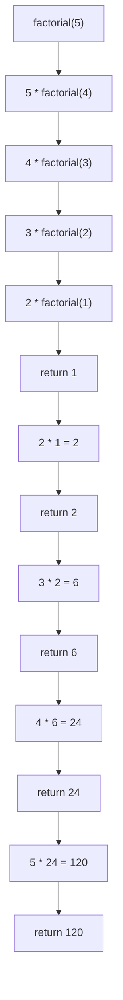
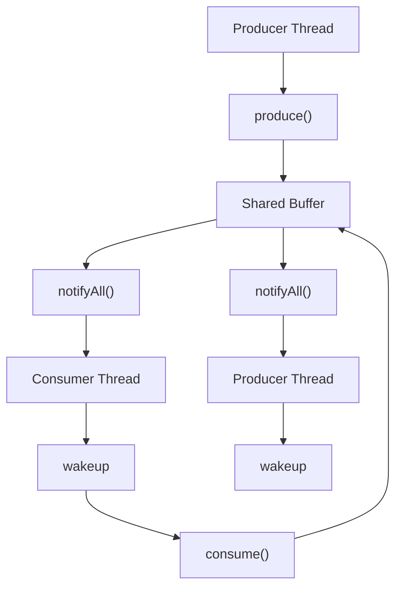
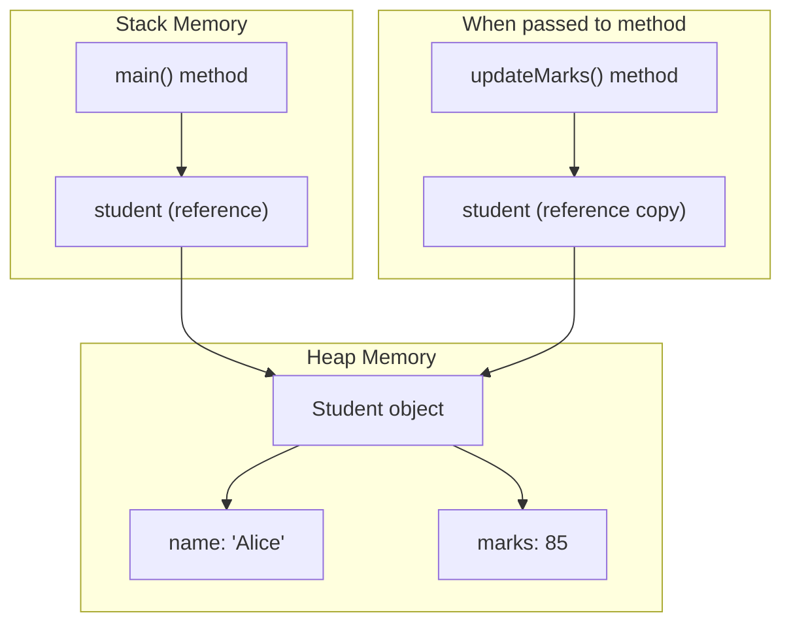
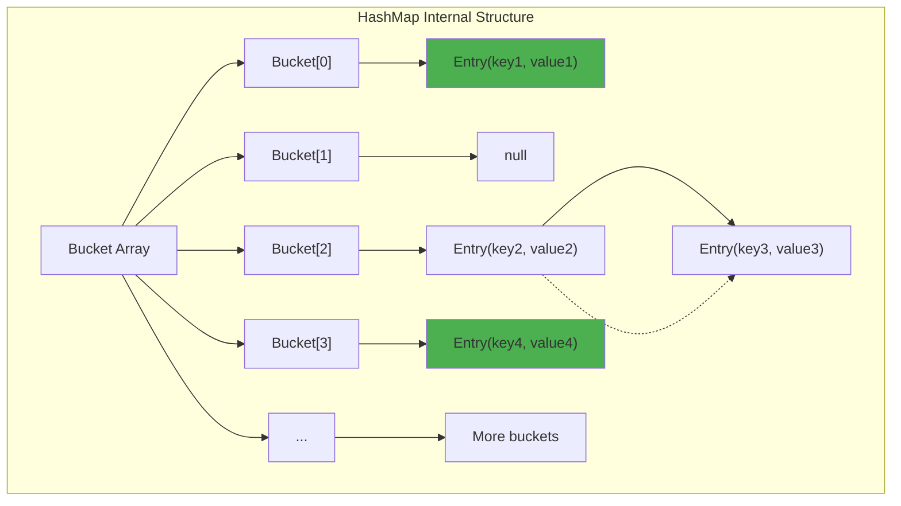
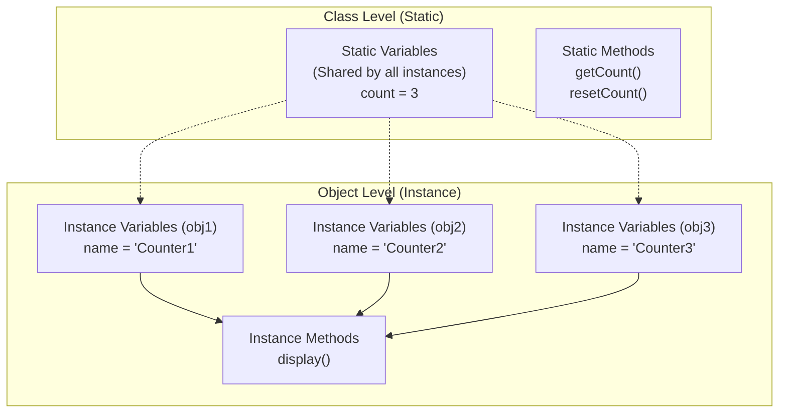
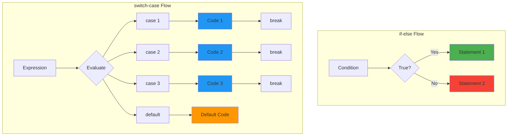

# **Java Object-Oriented Programming Language - Comprehensive Guide**

## **Subject: Object-Oriented Programming in Java**

---

## **Question 1: Differentiate between Instance Methods and Static Methods**

### **Points (Comparison Table):**

| **Aspect** | **Instance Methods** | **Static Methods** |
|------------|---------------------|--------------------|
| **Dependency** | Belong to **individual objects**; require object instantiation to call | Belong to the **class itself**; can be called using `ClassName.method()` without creating an object |
| **Access & Keywords** | Can access **instance** and **static** members; may use `this` and `super` | Can **only** access static members directly; **cannot** use `this` or `super` |
| **Invocation** | Called through object reference: `obj.method()` or implicitly via `this` | Called through class name or from same class: `Class.method()`; also callable from instance but still refers to class-level method |
| **Overriding / Polymorphism** | Can be **overridden**; supports dynamic (runtime) polymorphism | Cannot be overridden (only **hidden**); resolved at compile-time (static binding) |
| **Memory & Allocation** | Bound to object instances; related instance state stored on **heap** | Stored in method area (class area) and shared across instances; single copy per class in memory |
| **Use Cases** | Use when operation depends on **object state** (getters, setters, business logic, use of instance fields) | Use when **stateless** functionality is needed (utility methods, factory methods, helper functions, single configuration values) |
| **Examples & Notes** | `obj.getName()`, instance field manipulation, behavior varies per object | `Math.sqrt()`, `Collections.sort()`, configuration loaders — often stateless and thread-safe |
| **Inheritance and Method Resolution** | Can be inherited and **overridden** in subclasses; supports inheritance hierarchy | Can be inherited but **hidden** (not overridden) in subclasses; no inheritance polymorphism |
| **Thread Safety** | Not inherently thread-safe; depends on implementation and synchronization | Can be thread-safe if stateless; shared across all instances requires careful synchronization |
| **Performance Considerations** | Slight overhead due to object reference and potential virtual method calls | Generally faster due to direct access and static binding; no object instantiation needed |
| **Error Handling** | Can throw checked and unchecked exceptions; supports try-catch blocks | Same exception handling capabilities as instance methods |
| **Method Hiding vs Overriding** | **Overridden** in subclasses; child class version called for child objects | **Hidden** in subclasses; parent class version always called regardless of object type |
| **Static Binding vs Dynamic Binding** | **Dynamic binding** (runtime polymorphism); method resolved at execution time | **Static binding** (compile-time resolution); method resolved during compilation |
| **Initialization Requirements** | Can access instance variables; requires object to be properly initialized | Cannot access instance variables; can only use static variables and other static methods |
| **Usage in Interfaces** | Can be declared in interfaces as default or abstract methods | Cannot be declared in interfaces; static methods in interfaces are utility methods only |

> Tip: Prefer **instance methods** when behavior depends on stored object state, and **static methods** for reusable, stateless helpers. If you need polymorphic behavior, use instance methods.

### **Code Example:**

```java
class Calculator {
    int value = 10;  // Instance variable
    static int count = 0;  // Static variable
    
    public int add(int a) { return a + value; }  // Instance method
    public static int multiply(int a, int b) { return a * b; }  // Static method
}

public class Main {
    public static void main(String[] args) {
        Calculator c = new Calculator();
        System.out.println(c.add(5));  // 15
        System.out.println(Calculator.multiply(5, 3));  // 15
    }
}
```

### **Key Differences:**

| **Aspect** | **Instance Method** | **Static Method** |
|------------|-------------------|------------------|
| **Memory** | Stored in heap | Stored in method area |
| **Access** | Through object | Through class name |
| **Variables** | All variables | Only static variables |

---

## **Question 2 & 3: Develop a Java Program to Calculate Factorial Using Recursion**

### **Points — Quick Explanation & Pseudocode:**

- **Pseudocode (core idea):**

```
function factorial(n):
     if n <= 1:
          return 1          # base case
     else:
          return n * factorial(n - 1)  # recursive case
```

- **Short explanation:**
  - Base case prevents infinite recursion and returns a simple value (1) for n <= 1.
  - Recursive case reduces the problem (n → n-1) and combines results: n * factorial(n-1).
  - Each call pushes a frame on the call stack; when base case returns, frames unwind multiplying results.
  - Time complexity: O(n) — each call does O(1) work and recurs n times.
  - Space complexity: O(n) — due to n stacked frames on the call stack.

- **When to use/avoid:**
  - Use recursion for problems with natural recursive structure (factorial, tree traversal, divide-and-conquer).
  - Avoid heavy recursion for very large n in Java (risk of StackOverflowError); prefer iterative if necessary.


### **Code Example:**

```java
public class FactorialCalculator {
    public static long factorial(int n) {
        if (n <= 1) return 1;  // Base case
        return n * factorial(n - 1);  // Recursive case
    }
    
    public static void main(String[] args) {
        System.out.println("5! = " + factorial(5));  // Output: 120
    }
}
```

### **Flow Diagram:**




---

## **Question 4 & 16: Summarize the Rules for Operator Precedence in Java**

### **Points:**

1. **Parentheses and Postfix Operators (Highest Priority):**
   - **Parentheses `()`** have the highest precedence and override all other operators
   - **Postfix operators** `expr++` and `expr--` execute after the expression is evaluated
   - **Array access `[]`** and **method calls `()`** are also postfix operations
   - These operators are evaluated **left to right** in expressions
   - Always use parentheses for clarity in complex expressions

2. **Unary Operators:**
   - **Prefix increment/decrement:** `++expr`, `--expr` execute before expression evaluation
   - **Unary plus/minus:** `+expr`, `-expr` for positive/negative values
   - **Logical NOT:** `!` inverts boolean values
   - **Bitwise complement:** `~` inverts all bits
   - Unary operators are evaluated **right to left**
   - Higher precedence than binary arithmetic operators

3. **Multiplicative and Additive Operators:**
   - **Multiplicative operators:** `*` (multiply), `/` (divide), `%` (modulo) have higher precedence
   - **Additive operators:** `+` (add), `-` (subtract) have lower precedence than multiplicative
   - Expression `2 + 3 * 4` evaluates as `2 + (3 * 4) = 14`, not `(2 + 3) * 4 = 20`
   - Both categories are evaluated **left to right**
   - Division by zero throws **ArithmeticException** for integers

4. **Shift Operators:**
   - **Left shift `<<`:** Shifts bits left, fills with zeros (multiplies by 2^n)
   - **Signed right shift `>>`:** Shifts bits right, preserves sign bit
   - **Unsigned right shift `>>>`:** Shifts bits right, fills with zeros
   - Lower precedence than additive operators
   - Commonly used in **bit manipulation** and **optimization**

5. **Relational and Equality Operators:**
   - **Relational:** `<`, `>`, `<=`, `>=` compare numeric values
   - **Type checking:** `instanceof` checks object type
   - **Equality:** `==` (equal), `!=` (not equal) compare values or references
   - Relational operators have **higher precedence** than equality operators
   - Result is always **boolean** (true/false)
   - Use `.equals()` method for object content comparison

6. **Bitwise and Logical Operators:**
   - **Bitwise AND `&`:** Compares each bit, both must be 1
   - **Bitwise XOR `^`:** Compares each bit, different values give 1
   - **Bitwise OR `|`:** Compares each bit, at least one must be 1
   - **Logical AND `&&`:** Short-circuit evaluation, stops if first is false
   - **Logical OR `||`:** Short-circuit evaluation, stops if first is true
   - Bitwise operators work on **integer types**, logical on **boolean**

7. **Ternary and Assignment Operators (Lowest Priority):**
   - **Ternary operator `? :`:** `condition ? trueValue : falseValue` is a compact if-else
   - **Assignment operators:** `=`, `+=`, `-=`, `*=`, `/=`, `%=`, `&=`, `|=`, `^=`, `<<=`, `>>=`, `>>>=`
   - Assignment has the **lowest precedence** of all operators
   - Evaluated **right to left:** `a = b = c = 5` assigns 5 to all variables
   - Compound assignments combine operation and assignment in one step

### **Code Example:**

```java
public class OperatorPrecedence {
    public static void main(String[] args) {
        System.out.println(10 + 5 * 2);        // 20 (* before +)
        System.out.println((10 + 5) * 2);      // 30 (parentheses first)
        System.out.println(5 > 3 && 10 < 20);  // true
        System.out.println(true || false && false); // true (&& before ||)
        System.out.println(15 > 10 ? 100 : 200);    // 100 (ternary)
    }
}
```

### **Operator Precedence Table:**

| **Level** | **Operator** | **Description** | **Associativity** |
|-----------|-------------|-----------------|-------------------|
| 1 (Highest) | `()`, `[]`, `.` | Parentheses, Array, Member | Left to Right |
| 2 | `++`, `--` (postfix) | Postfix increment/decrement | Left to Right |
| 3 | `++`, `--`, `+`, `-`, `!`, `~` | Unary operators | Right to Left |
| 4 | `*`, `/`, `%` | Multiplicative | Left to Right |
| 5 | `+`, `-` | Additive | Left to Right |
| 6 | `<<`, `>>`, `>>>` | Shift | Left to Right |
| 7 | `<`, `<=`, `>`, `>=`, `instanceof` | Relational | Left to Right |
| 8 | `==`, `!=` | Equality | Left to Right |
| 9 | `&` | Bitwise AND | Left to Right |
| 10 | `^` | Bitwise XOR | Left to Right |
| 11 | `|` | Bitwise OR | Left to Right |
| 12 | `&&` | Logical AND | Left to Right |
| 13 | `||` | Logical OR | Left to Right |
| 14 | `? :` | Ternary | Right to Left |
| 15 (Lowest) | `=`, `+=`, `-=`, etc. | Assignment | Right to Left |

---

## **Question 5 & 17: Explain the Usage of the Super Keyword with Examples**

### **Points:**

1. **Accessing Parent Class Variables:**
   - **`super.variable`** explicitly references parent class member variables
   - Necessary when **child class shadows** parent's variable with same name
   - Allows access to **hidden parent fields** from within child class
   - Without `super`, child's variable takes precedence in child class methods
   - Useful for maintaining **separate state** in parent and child
   - Commonly used when extending classes with similar field names

2. **Calling Parent Class Methods:**
   - **`super.method()`** invokes the parent class version of an overridden method
   - Essential for **extending functionality** rather than completely replacing it
   - Allows child to **reuse parent logic** and add additional behavior
   - Common pattern: `super.method()` followed by child-specific code
   - Prevents **code duplication** by leveraging parent implementation
   - Mandatory when you want both parent and child behavior to execute

3. **Constructor Chaining with super():**
   - **`super()`** must be the **first statement** in child class constructor
   - Invokes parent class constructor to **initialize inherited members**
   - Java automatically inserts **`super()`** if not explicitly provided (calls no-arg constructor)
   - If parent has **no default constructor**, explicit `super(args)` is mandatory
   - Ensures **proper initialization hierarchy** from top to bottom of inheritance tree
   - Compiler error occurs if `super()` is not first statement

4. **Resolving Variable Name Conflicts:**
   - When parent and child have **same variable name**, child's version hides parent's
   - **`super.variableName`** accesses parent's version, **`this.variableName`** accesses child's
   - Without qualifier, Java uses the **closest scope** (child's variable)
   - Enables maintaining **different values** for conceptually similar properties
   - Useful in scenarios like different speed limits for Vehicle vs Car

5. **Inheritance Hierarchy Initialization:**
   - Constructors execute in **top-down order**: grandparent → parent → child
   - Each level initializes its own **specific members** before child proceeds
   - **`super()`** ensures parent is **fully constructed** before child initialization
   - Prevents accessing **uninitialized parent state** from child constructor
   - Critical for maintaining **object integrity** across inheritance levels

6. **Limitations and Rules:**
   - **Cannot use `super.super`** to access grandparent members (only immediate parent)
   - **Static methods** cannot use `super` as they belong to class, not instances
   - **`super()`** cannot be used in **static context** or after other statements
   - Only works in **inheritance relationships**, not with interfaces (use interface name)
   - Cannot access **private members** of parent even with `super`

### **Code Example:**

```java
class Vehicle {
    int speed = 100;
    public void start() { System.out.println("Vehicle starts"); }
}

class Car extends Vehicle {
    int speed = 150;  // Shadows parent's speed
    
    @Override
    public void start() {
        super.start();  // Call parent method
        System.out.println("Car starts");
    }
    
    public void showSpeeds() {
        System.out.println("Parent: " + super.speed + ", Child: " + this.speed);
    }
}

public class SuperDemo {
    public static void main(String[] args) {
        new Car().start();  // Both messages
        new Car().showSpeeds();  // Parent: 100, Child: 150
    }
}
```

### **Super Keyword Usage Table:**

| **Usage** | **Syntax** | **Purpose** | **When Required** |
|-----------|------------|-------------|-------------------|
| **Variable Access** | `super.variable` | Access parent's field | When child shadows parent variable |
| **Method Call** | `super.method()` | Call parent's method | When extending overridden method |
| **Constructor Call** | `super(args)` | Invoke parent constructor | When parent has no default constructor |
| **Resolving Ambiguity** | `super.member` | Distinguish parent from child | Name conflicts in inheritance |

---

## **Question 6: Evaluate the Impact of Using Final Keyword in Inheritance**

### **Points:**

1. **Final Classes and Inheritance Prevention:**
   - Cannot be extended by any other class (e.g., `String`, `Integer`, `Boolean`)
   - Prevents inheritance completely, ensuring **class design integrity**
   - Used for **security reasons** to prevent malicious code from overriding critical functionality
   - Ensures **immutability patterns** where object state cannot be modified after creation
   - Examples include wrapper classes, utility classes, and security-sensitive classes
   - Compiler optimization possible since no subclassing means **no dynamic dispatch**

2. **Final Methods and Method Overriding Control:**
   - Cannot be overridden in child classes but can still be **inherited and called**
   - Maintains **method contract** ensuring specific behavior cannot be altered
   - Critical for **template method patterns** where certain steps must remain unchanged
   - Allows **partial inheritance** - child can extend class but not modify specific methods
   - Used in **framework design** to provide stable APIs while allowing customization
   - Enables **compiler optimizations** through method inlining since method cannot change

3. **Final Variables and Constants:**
   - Become **constants** once initialized, cannot be reassigned
   - Must be initialized **during declaration** or **in constructor** (blank finals)
   - Creates **compile-time constants** when combined with `static` (e.g., `static final`)
   - Enables **thread-safe sharing** without synchronization since value cannot change
   - Supports **immutable object design** by making all fields final
   - Prevents **accidental modification** of important configuration values

4. **Performance and Optimization Benefits:**
   - **Compiler optimizations** possible since final entities cannot be changed
   - **Method inlining** for final methods improves runtime performance
   - **Constant folding** for final variables reduces runtime computation
   - **Elimination of virtual method calls** for final methods in inheritance hierarchy
   - **Memory efficiency** through shared final static variables
   - **Reduced overhead** in method dispatch for final methods

5. **Design Patterns and Best Practices:**
   - **Immutable object pattern** using final fields to ensure thread safety
   - **Template method pattern** with final methods defining unchangeable algorithm steps
   - **Constant interface anti-pattern** avoided by using final static variables in classes
   - **Defensive programming** by making sensitive methods and classes final
   - **API stability** ensuring critical functionality cannot be compromised
   - **Code documentation** - final keyword serves as intent declaration

6. **Limitations and Trade-offs:**
   - **Reduced flexibility** in object-oriented design and extensibility
   - **Testing challenges** since final classes/methods cannot be mocked easily
   - **Framework limitations** where reflection or proxying may be restricted
   - **Inheritance blocking** may prevent legitimate use cases requiring extension
   - **Maintenance overhead** when requirements change and final restrictions become limiting
   - **Balance needed** between security/performance and flexibility/extensibility

### **Code Example:**

```java
// Final class - cannot be inherited
final class FinalClass {
    public void display() { System.out.println("Final class"); }
}

class Parent {
    final int CONSTANT = 100;  // Final variable
    public final void finalMethod() { System.out.println("Cannot override"); }
    public void regularMethod() { System.out.println("Can override"); }
}

class Child extends Parent {
    @Override
    public void regularMethod() { System.out.println("Overridden"); }
    // Cannot override finalMethod() - compilation error
}

public class FinalDemo {
    public static void main(String[] args) {
        Child c = new Child();
        c.finalMethod();     // "Cannot override"
        c.regularMethod();   // "Overridden"
        System.out.println(c.CONSTANT);  // 100
    }
}
```

### **Impact Summary:**

| **Final Type** | **Impact** | **Use Case** |
|----------------|------------|--------------|
| **Class** | No inheritance | Security, Immutability |
| **Method** | No overriding | Critical functionality |
| **Variable** | No reassignment | Constants |

---

## **Question 7 & 19: Illustrate the Concept of User-Defined Exceptions**

### **Points:**

1. **Exception Hierarchy and Classification:**
   - All exceptions inherit from **`java.lang.Throwable`** (root of exception hierarchy)
   - **Checked exceptions** extend `Exception` class - must be caught or declared with `throws`
   - **Unchecked exceptions** extend `RuntimeException` - optional to handle
   - **Errors** (like OutOfMemoryError) extend `Error` - represent serious JVM problems
   - Checked exceptions force **compile-time handling**, unchecked allow **runtime handling**
   - Custom exceptions should extend appropriate parent based on handling requirements

2. **Creating Custom Checked Exceptions:**
   - Extend **`Exception`** class for business logic violations requiring mandatory handling
   - Provide **multiple constructors**: no-arg, message-only, message with cause, full parameters
   - Include **additional fields** to store context (e.g., account balance, requested amount)
   - Override **`toString()`** or **`getMessage()`** for detailed error information
   - Use for **recoverable errors** where caller must take corrective action
   - Examples: InsufficientFundsException, InvalidCredentialsException, DuplicateRecordException

3. **Creating Custom Unchecked Exceptions:**
   - Extend **`RuntimeException`** for programming errors or unrecoverable conditions
   - Do **not require** `throws` declaration in method signature
   - Used for **validation errors** that indicate bugs (e.g., invalid configuration)
   - Allows **cleaner code** by avoiding excessive try-catch blocks
   - Examples: InvalidConfigurationException, IllegalStateException subclasses
   - Should be thrown for **programmer mistakes**, not business rule violations

4. **Best Practices for Custom Exceptions:**
   - **Meaningful names:** Exception name should clearly indicate the error (e.g., `AccountLockedException`)
   - **Detailed messages:** Include context like actual vs expected values
   - **Serializable:** Implement `Serializable` if exceptions may cross JVM boundaries
   - **Immutable:** Make exception fields final to prevent modification after creation
   - **Document thoroughly:** Use Javadoc to explain when and why exception is thrown
   - **Avoid overuse:** Create custom exceptions only when built-in exceptions don't fit

5. **Exception Chaining and Context:**
   - Store **original exception** as cause using `super(message, cause)` constructor
   - Preserves **complete stack trace** for debugging root cause
   - Add **domain-specific context** while maintaining technical details
   - Use **`getCause()`** method to retrieve original exception
   - Prevents **losing critical debugging information** when wrapping exceptions

6. **When to Use Checked vs Unchecked:**
   - **Use checked** when caller **can reasonably recover** (e.g., retry, alternative flow)
   - **Use unchecked** for **programming errors** or conditions caller cannot fix
   - **Use checked** for **business rule violations** that are part of normal flow
   - **Use unchecked** for **configuration errors** or invalid application state
   - Modern tendency: prefer unchecked to avoid **exception handling clutter**
   - Consider **API usability**: checked exceptions make APIs harder to use

### **Code Example:**

```java
// Custom checked exception
class InsufficientFundsException extends Exception {
    public InsufficientFundsException(String msg) {
        super(msg);
    }
}

// Custom unchecked exception
class InvalidAccountException extends RuntimeException {
    public InvalidAccountException(String msg) {
        super(msg);
    }
}

// Usage
class BankAccount {
    private double balance = 1000;
    
    public void withdraw(double amount) throws InsufficientFundsException {
        if (amount > balance) {
            throw new InsufficientFundsException("Not enough funds");
        }
        balance -= amount;
    }
}

public class ExceptionDemo {
    public static void main(String[] args) {
        try {
            new BankAccount().withdraw(1500);
        } catch (InsufficientFundsException e) {
            System.out.println("Error: " + e.getMessage());
        }
    }
}
```

### **Exception Type Comparison:**

| **Aspect** | **Checked Exception** | **Unchecked Exception** |
|------------|-----------------------|-------------------------|
| **Parent Class** | `Exception` | `RuntimeException` |
| **Handling** | Mandatory (catch or throws) | Optional |
| **Compilation** | Must declare or catch | No requirement |
| **Use Case** | Recoverable errors | Programming errors |
| **Examples** | IOException, SQLException | NullPointerException, IllegalArgumentException |
| **When to Use** | Business logic violations | Validation failures |
| **Caller Action** | Can recover/retry | Usually cannot recover |
| **Code Impact** | More verbose | Cleaner code |

---

## **Question 8: Create a Java Program to Implement Inter-Thread Communication Using wait(), notify(), and notifyAll()**

### **Points:**

1. **Inter-Thread Communication Fundamentals:**
   - Threads communicate using **wait()**, **notify()**, and **notifyAll()** methods from Object class
   - Must be called within **synchronized block or method** to acquire object lock
   - Solves **producer-consumer** and **reader-writer** synchronization problems
   - Enables threads to **signal state changes** to other waiting threads
   - Without communication, threads would waste CPU in **busy-waiting loops**
   - Alternative to **polling**, provides efficient thread coordination

2. **wait() Method - Thread Suspension:**
   - **Releases the lock** on the object and puts thread in **waiting state**
   - Thread remains suspended until **notify()** or **notifyAll()** is called
   - Must be called in **synchronized context**, otherwise throws IllegalMonitorStateException
   - Can specify **timeout** with `wait(long timeout)` to avoid indefinite waiting
   - Always use in **while loop**, not if statement, to handle spurious wakeups
   - InterruptedException must be handled when thread is interrupted while waiting

3. **notify() Method - Single Thread Wakeup:**
   - Wakes up **one arbitrary thread** that is waiting on the object's monitor
   - Which specific thread is awakened is **JVM-dependent** (not predictable)
   - Awakened thread must **reacquire the lock** before continuing execution
   - Does **not release lock** immediately - releasing thread must exit synchronized block first
   - Use when **only one thread** needs to be notified about state change
   - More **efficient** than notifyAll() when only one thread should proceed

4. **notifyAll() Method - All Threads Wakeup:**
   - Wakes up **all threads** waiting on the object's monitor
   - All awakened threads compete to **reacquire the lock** (only one succeeds at a time)
   - Safer than notify() as it ensures **no thread is left waiting** indefinitely
   - Used when **multiple threads** may need to check updated condition
   - Prevents **deadlock situations** where specific thread needs notification but isn't notified
   - **Performance overhead**: all threads wake up and check condition, even if not ready

5. **Producer-Consumer Pattern:**
   - **Classic synchronization problem** where producers create data and consumers process it
   - **Shared buffer** acts as intermediate storage between producers and consumers
   - Producer **waits** when buffer is full, consumer **waits** when buffer is empty
   - **wait() in loop**: `while (condition) { wait(); }` prevents spurious wakeups
   - **notifyAll() after state change**: ensures all waiting threads check new state
   - Demonstrates **cooperative multithreading** where threads coordinate actions

6. **Best Practices and Common Pitfalls:**
   - **Always use wait() in while loop**, not if statement (spurious wakeup protection)
   - **Call wait/notify on same object** that is synchronized
   - **Prefer notifyAll() over notify()** to avoid missed notifications and deadlocks
   - **Handle InterruptedException** properly (restore interrupt status or propagate)
   - **Check condition before and after wait()** returns
   - **Avoid nested locks** which can lead to deadlock

### **Code Example:**

```java
class SharedBuffer {
    private int data;
    private boolean hasData = false;
    
    public synchronized void produce(int value) {
        while (hasData) try { wait(); } catch (InterruptedException e) {}
        data = value;
        hasData = true;
        System.out.println("Produced: " + value);
        notifyAll();
    }
    
    public synchronized int consume() {
        while (!hasData) try { wait(); } catch (InterruptedException e) {}
        int result = data;
        hasData = false;
        System.out.println("Consumed: " + result);
        notifyAll();
        return result;
    }
}

public class InterThreadDemo {
    public static void main(String[] args) {
        SharedBuffer buffer = new SharedBuffer();
        new Thread(() -> { for (int i = 1; i <= 3; i++) buffer.produce(i); }).start();
        new Thread(() -> { for (int i = 0; i < 3; i++) buffer.consume(); }).start();
    }
}
```

### **Communication Flow Diagram:**




---

## **Question 9 & 21 & 34: List the Different Interfaces in the Collection Framework and Define Collection Framework and its Importance**

### **Points:**

1. **Collection Framework Definition and Architecture:**
   - **Unified architecture** providing standard interfaces, implementations, and algorithms for group objects
   - Consists of **interfaces** (contracts), **implementations** (concrete classes), and **algorithms** (utility methods)
   - Root interface **`Collection`** extended by List, Set, Queue; **`Map`** is separate hierarchy
   - Provides **consistent API** across different data structures
   - Reduces programming effort by offering **ready-to-use** data structures
   - Enables **interoperability** between different collection types through common interfaces

2. **Collection Interface Hierarchy:**
   - **Collection (root):** Basic operations like add(), remove(), contains(), size()
   - **List:** Ordered collection allowing duplicates, index-based access
   - **Set:** Unordered collection prohibiting duplicates, based on equals() and hashCode()
   - **Queue:** FIFO (First-In-First-Out) or priority-based processing
   - **Deque:** Double-ended queue supporting insertion/removal at both ends
   - **Map (separate):** Key-value pairs, keys are unique, values can duplicate

3. **List Interface and Implementations:**
   - **ArrayList:** Resizable array, fast random access O(1), slow insertion/deletion O(n)
   - **LinkedList:** Doubly-linked list, fast insertion/deletion O(1), slow random access O(n)
   - **Vector:** Thread-safe ArrayList (legacy, avoid in new code)
   - **Maintains insertion order** and allows duplicates
   - **Index-based access** using get(index), set(index, element)
   - Best for **frequent access, less modification** scenarios

4. **Set Interface and Implementations:**
   - **HashSet:** Hash table based, O(1) operations, no order guarantee
   - **LinkedHashSet:** HashSet with predictable iteration order (insertion order)
   - **TreeSet:** Red-black tree based, sorted order, O(log n) operations
   - **No duplicates** based on equals() and hashCode() methods
   - **Null handling:** HashSet/LinkedHashSet allow one null, TreeSet doesn't allow null
   - Best for **uniqueness checks** and **membership testing**

5. **Queue and Deque Interfaces:**
   - **PriorityQueue:** Elements ordered by natural ordering or comparator
   - **ArrayDeque:** Resizable array implementation of Deque, faster than LinkedList
   - **LinkedList:** Implements both List and Deque interfaces
   - **Queue operations:** offer(), poll(), peek() (non-throwing versions)
   - **Deque operations:** addFirst(), addLast(), removeFirst(), removeLast()
   - Best for **FIFO processing**, **priority-based tasks**, and **undo mechanisms**

6. **Map Interface and Implementations:**
   - **HashMap:** Hash table based, O(1) operations, no order, allows one null key
   - **LinkedHashMap:** HashMap with predictable iteration order (insertion or access order)
   - **TreeMap:** Red-black tree based, sorted by keys, O(log n) operations
   - **Hashtable:** Legacy synchronized Map, no null keys/values
   - **Key-value pairs** where keys are unique (based on equals/hashCode)
   - Best for **fast lookups**, **caching**, and **associative arrays**

7. **Importance and Benefits:**
   - **Reduces development time:** No need to implement common data structures from scratch
   - **Increases performance:** Highly optimized implementations by Java experts
   - **Promotes consistency:** Standard methods across different collection types
   - **Enables interoperability:** Collections can be easily swapped without changing code logic
   - **Thread-safe alternatives:** Synchronized wrappers and concurrent collections available
   - **Utility algorithms:** Collections class provides sort(), search(), shuffle(), reverse()

### **Code Example:**

```java
import java.util.*;

public class CollectionDemo {
    public static void main(String[] args) {
        // List - allows duplicates
        List<String> list = new ArrayList<>();
        list.add("Java"); list.add("Python"); list.add("Java");
        System.out.println("List: " + list);
        
        // Set - no duplicates
        Set<Integer> set = new HashSet<>();
        set.add(1); set.add(2); set.add(1);  // Duplicate ignored
        System.out.println("Set: " + set);
        
        // Map - key-value pairs
        Map<String, Integer> map = new HashMap<>();
        map.put("Java", 95); map.put("Python", 87);
        System.out.println("Map: " + map);
    }
}
```

### **Collection Framework Hierarchy:**

```
Collection (Interface)
├── List (Interface)
│   ├── ArrayList (Class)
│   ├── LinkedList (Class)
│   └── Vector (Class)
├── Set (Interface)
│   ├── HashSet (Class)
│   ├── LinkedHashSet (Class)
│   └── TreeSet (Class)
└── Queue (Interface)
    ├── PriorityQueue (Class)
    └── Deque (Interface)
        └── ArrayDeque (Class)

Map (Interface) - Separate Hierarchy
├── HashMap (Class)
├── LinkedHashMap (Class)
├── TreeMap (Class)
└── Hashtable (Class)
```

### **Core Interfaces Comparison:**

| **Interface** | **Duplicates** | **Ordering** | **Null Elements** | **Common Implementations** | **Use Case** |
|---------------|---------------|--------------|-------------------|----------------------------|-------------|
| **List** | ✅ Yes | Insertion order | ✅ Allowed | ArrayList, LinkedList | Ordered collection with duplicates |
| **Set** | ❌ No | Varies by impl | ✅ One null (Hash) | HashSet, TreeSet | Unique elements |
| **Queue** | ✅ Yes | FIFO or priority | Varies by impl | PriorityQueue, ArrayDeque | Task processing |
| **Map** | Keys: No, Values: Yes | Varies by impl | ✅ One null key | HashMap, TreeMap | Key-value associations |

### **Code Example:**

```java
import java.util.*;

public class CollectionFrameworkDemo {
    public static void main(String[] args) {
        // List interface implementations
        demonstrateList();
        
        // Set interface implementations
        demonstrateSet();
        
        // Queue interface implementations
        demonstrateQueue();
        
        // Map interface implementations
        demonstrateMap();
    }
    
    // List interface demo
    public static void demonstrateList() {
        System.out.println("=== LIST INTERFACE ===");
        
        // ArrayList - Resizable array
        List<String> arrayList = new ArrayList<>();
        arrayList.add("Java");
        arrayList.add("Python");
        arrayList.add("Java"); // Duplicates allowed
        
        // LinkedList - Doubly linked list
        List<String> linkedList = new LinkedList<>();
        linkedList.add("C++");
        linkedList.add("JavaScript");
        
        System.out.println("ArrayList: " + arrayList);
        System.out.println("LinkedList: " + linkedList);
    }
    
    // Set interface demo
    public static void demonstrateSet() {
        System.out.println("\n=== SET INTERFACE ===");
        
        // HashSet - No duplicates, no order
        Set<Integer> hashSet = new HashSet<>();
        hashSet.add(1);
        hashSet.add(2);
        hashSet.add(1); // Duplicate ignored
        
        // TreeSet - Sorted set
        Set<Integer> treeSet = new TreeSet<>();
        treeSet.add(30);
        treeSet.add(10);
        treeSet.add(20);
        
        // LinkedHashSet - Maintains insertion order
        Set<String> linkedHashSet = new LinkedHashSet<>();
        linkedHashSet.add("First");
        linkedHashSet.add("Second");
        linkedHashSet.add("Third");
        
        System.out.println("HashSet: " + hashSet);
        System.out.println("TreeSet: " + treeSet);
        System.out.println("LinkedHashSet: " + linkedHashSet);
    }
    
    // Queue interface demo
    public static void demonstrateQueue() {
        System.out.println("\n=== QUEUE INTERFACE ===");
        
        // PriorityQueue - Natural ordering
        Queue<Integer> priorityQueue = new PriorityQueue<>();
        priorityQueue.offer(30);
        priorityQueue.offer(10);
        priorityQueue.offer(20);
        
        // LinkedList as Queue
        Queue<String> queue = new LinkedList<>();
        queue.offer("First");
        queue.offer("Second");
        queue.offer("Third");
        
        System.out.println("PriorityQueue: " + priorityQueue);
        System.out.println("Queue: " + queue);
        System.out.println("Poll from queue: " + queue.poll());
    }
    
    // Map interface demo
    public static void demonstrateMap() {
        System.out.println("\n=== MAP INTERFACE ===");
        
        // HashMap - Key-value pairs
        Map<String, Integer> hashMap = new HashMap<>();
        hashMap.put("Java", 95);
        hashMap.put("Python", 87);
        hashMap.put("C++", 92);
        
        // TreeMap - Sorted by keys
        Map<String, Integer> treeMap = new TreeMap<>();
        treeMap.put("Zebra", 1);
        treeMap.put("Apple", 2);
        treeMap.put("Banana", 3);
        
        System.out.println("HashMap: " + hashMap);
        System.out.println("TreeMap: " + treeMap);
    }
}
```

### **Collection Framework Hierarchy:**

```
Collection (Interface)
├── List (Interface)
│   ├── ArrayList
│   ├── LinkedList
│   └── Vector
├── Set (Interface)
│   ├── HashSet
│   ├── TreeSet
│   └── LinkedHashSet
└── Queue (Interface)
    ├── PriorityQueue
    └── LinkedList

Map (Interface) - Separate hierarchy
├── HashMap
├── TreeMap
└── LinkedHashMap
```

### **Core Interfaces Summary:**

| **Interface** | **Duplicates** | **Ordering** | **Examples** |
|---------------|---------------|--------------|--------------|
| **List** | Yes | Insertion order | ArrayList, LinkedList |
| **Set** | No | Varies | HashSet, TreeSet |
| **Queue** | Yes | FIFO | PriorityQueue, LinkedList |
| **Map** | No (keys) | Varies | HashMap, TreeMap |

---

## **Question 10: Evaluate When to Use TreeSet Over HashSet**

### **Points:**

1. **TreeSet Characteristics and Advantages:**
   - **Maintains sorted order** automatically using natural ordering or custom Comparator
   - Implements **NavigableSet** interface providing navigation methods
   - **Sorted iteration:** Elements always retrieved in ascending order
   - **Range view operations:** subSet(), headSet(), tailSet() for extracting portions
   - **O(log n)** time complexity for add, remove, contains operations
   - Based on **Red-Black tree** (self-balancing binary search tree)
   - **No null elements** allowed (throws NullPointerException)

2. **HashSet Characteristics and Advantages:**
   - **Constant time performance** O(1) for add, remove, contains (average case)
   - **No ordering guarantee:** Elements stored in hash table, iteration order unpredictable
   - **Better performance** for basic operations compared to TreeSet
   - **Less memory overhead:** No tree structure maintenance required
   - **Allows one null** element
   - Based on **HashMap** internally
   - **Faster for large datasets** when sorting not required

3. **When to Use TreeSet:**
   - Need elements in **sorted order** for iteration or display
   - Require **range queries** like "all elements between X and Y"
   - Need **navigation methods**: first(), last(), higher(), lower(), ceiling(), floor()
   - Implementing **sorted unique collection** (e.g., leaderboard, priority list)
   - Acceptable to trade **performance for ordering**
   - Working with **comparable objects** or have custom comparator

4. **When to Use HashSet:**
   - **Performance is critical** and ordering not required
   - Need **fast membership testing** (contains operation)
   - Building **unique element collection** without sorting
   - Working with **large datasets** where O(1) vs O(log n) matters
   - **Memory efficiency** is important
   - Objects may not be **Comparable** or have natural ordering

5. **Performance Comparison:**
   - **Add operation:** HashSet O(1) vs TreeSet O(log n)
   - **Remove operation:** HashSet O(1) vs TreeSet O(log n)
   - **Contains operation:** HashSet O(1) vs TreeSet O(log n)
   - **Iteration:** Both O(n), but TreeSet yields sorted order
   - **Bulk operations:** HashSet generally faster
   - **Memory:** TreeSet uses more memory for tree node pointers

6. **Functional Differences:**
   - **TreeSet provides:** first(), last(), pollFirst(), pollLast(), descendingSet(), ceiling(), floor()
   - **Range operations:** subSet(from, to), headSet(to), tailSet(from)
   - **Navigation:** higher(e) returns least element > e, lower(e) returns greatest element < e
   - **HashSet lacks** all navigation and range operations
   - **TreeSet requires** elements to be Comparable or provide Comparator

7. **Use Case Decision Matrix:**
   - **Dictionary/Glossary:** TreeSet (alphabetical order needed)
   - **Unique visitor tracking:** HashSet (just uniqueness, no order)
   - **Student grades leaderboard:** TreeSet (sorted ranking required)
   - **Email subscription list:** HashSet (fast add/check, no order)
   - **Event scheduler:** TreeSet (chronological order needed)
   - **Cache invalidation:** HashSet (fast membership test)

### **Code Example:**

```java
import java.util.*;

public class SetComparison {
    public static void main(String[] args) {
        int[] numbers = {50, 30, 70, 20, 40};
        
        // HashSet - fast, unordered
        Set<Integer> hashSet = new HashSet<>();
        for (int n : numbers) hashSet.add(n);
        System.out.println("HashSet (unordered): " + hashSet);
        
        // TreeSet - sorted, slower
        TreeSet<Integer> treeSet = new TreeSet<>(Arrays.asList(numbers));
        System.out.println("TreeSet (sorted): " + treeSet);
        
        // TreeSet navigation methods
        System.out.println("First: " + treeSet.first());
        System.out.println("Last: " + treeSet.last());
        System.out.println("Higher than 35: " + treeSet.higher(35));
        
        // Range operations (TreeSet only)
        System.out.println("Elements < 50: " + treeSet.headSet(50));
        System.out.println("Elements >= 40: " + treeSet.tailSet(40));
    }
}
```

### **Decision Matrix:**

| **Requirement** | **Use HashSet** | **Use TreeSet** |
|----------------|-----------------|-----------------|
| **Fast operations** | ✅ | ❌ |
| **Sorted data** | ❌ | ✅ |
| **Range queries** | ❌ | ✅ |
| **Memory efficiency** | ✅ | ❌ |
| **Large datasets** | ✅ | ❌ |
| **Navigation** | ❌ | ✅ |

### **Performance Comparison:**

| **Operation** | **HashSet** | **TreeSet** |
|---------------|-------------|-------------|
| **Add** | O(1) | O(log n) |
| **Remove** | O(1) | O(log n) |
| **Contains** | O(1) | O(log n) |
| **Iteration** | O(n) | O(n) |

---

## **Question 11: Evaluate the Effectiveness of Using JavaFX Over Swing for Modern GUI Development**

### **Points:**

1. **JavaFX Advantages:**
   - **Modern UI:** Rich graphics and animations
   - **CSS Styling:** Separate style from logic
   - **FXML Support:** Declarative UI design
   - **Media Support:** Built-in audio/video support
   - **Hardware Acceleration:** Better performance

2. **Swing Advantages:**
   - **Mature Framework:** Stable and well-tested
   - **Extensive Documentation:** Large community support
   - **Look and Feel:** Platform-specific appearance
   - **Lightweight:** Smaller memory footprint

3. **Comparison Areas:**
   - **Performance:** JavaFX is hardware-accelerated
   - **Styling:** JavaFX uses CSS, Swing uses LAF
   - **Learning Curve:** JavaFX steeper initially
   - **Future Support:** JavaFX is the future

### **Code Example - JavaFX:**

```java
import javafx.application.Application;
import javafx.scene.Scene;
import javafx.scene.control.*;
import javafx.scene.layout.VBox;
import javafx.stage.Stage;

public class JavaFXExample extends Application {
    public void start(Stage stage) {
        Button btn = new Button("Click Me");
        btn.setStyle("-fx-background-color: blue; -fx-text-fill: white;");
        btn.setOnAction(e -> System.out.println("JavaFX Button Clicked!"));
        
        VBox root = new VBox(btn);
        stage.setScene(new Scene(root, 200, 100));
        stage.show();
    }
    public static void main(String[] args) { launch(args); }
}
```

### **Code Example - Swing:**

```java
import javax.swing.*;
import java.awt.*;

public class SwingExample {
    public static void main(String[] args) {
        JFrame frame = new JFrame("Swing App");
        JButton btn = new JButton("Click Me");
        btn.setBackground(Color.BLUE);
        btn.setForeground(Color.WHITE);
        btn.addActionListener(e -> System.out.println("Swing Button Clicked!"));
        
        frame.add(btn);
        frame.setSize(200, 100);
        frame.setDefaultCloseOperation(JFrame.EXIT_ON_CLOSE);
        frame.setVisible(true);
    }
}
```

### **Comparison Table:**

| **Aspect** | **JavaFX** | **Swing** |
|------------|------------|-----------|
| **Performance** | Hardware-accelerated | Software rendering |
| **Styling** | CSS support | Look and Feel |
| **Animation** | Built-in | Third-party libraries |
| **Media** | Audio/Video support | Limited |
| **Learning Curve** | Steeper | Moderate |
| **Future** | Actively developed | Maintenance mode |
| **Mobile** | Can target mobile | Desktop only |

### **Recommendation:**
- **Choose JavaFX** for new projects requiring modern UI
- **Choose Swing** for legacy applications or simple desktop apps
- **Consider migration** from Swing to JavaFX for long-term projects

---

## **Question 12: Design a Mini Student Registration System Using Swing Components**

### **Points:**

1. **System Requirements:**
   - **Student Information:** Name, ID, Email, Phone
   - **Course Selection:** Multiple course options
   - **Validation:** Input validation and error handling
   - **Data Storage:** Simple in-memory storage

2. **Swing Components Used:**
   - **JFrame:** Main window
   - **JTextField:** Text input fields
   - **JComboBox:** Dropdown selections
   - **JButton:** Action buttons
   - **JTable:** Display registered students

### **Code Example - Simplified Student Registration System:**

```java
import javax.swing.*;
import java.awt.*;
import java.util.ArrayList;

class Student {
    String id, name, course;
    Student(String id, String name, String course) { this.id = id; this.name = name; this.course = course; }
}

public class StudentRegistration extends JFrame {
    private ArrayList<Student> students = new ArrayList<>();
    private JTextField idField = new JTextField(10);
    private JTextField nameField = new JTextField(10);
    private JComboBox<String> courseBox = new JComboBox<>(new String[]{"CS", "IT", "ECE"});
    private JTextArea display = new JTextArea(10, 30);
    
    public StudentRegistration() {
        JButton addBtn = new JButton("Add Student");
        addBtn.addActionListener(e -> {
            String id = idField.getText(), name = nameField.getText();
            if (!id.isEmpty() && !name.isEmpty()) {
                students.add(new Student(id, name, courseBox.getSelectedItem().toString()));
                display.append(id + " - " + name + " - " + courseBox.getSelectedItem() + "\n");
                idField.setText(""); nameField.setText("");
            }
        });
        
        JPanel form = new JPanel();
        form.add(new JLabel("ID:")); form.add(idField);
        form.add(new JLabel("Name:")); form.add(nameField);
        form.add(new JLabel("Course:")); form.add(courseBox); form.add(addBtn);
        
        add(form, BorderLayout.NORTH);
        add(new JScrollPane(display), BorderLayout.CENTER);
        setTitle("Student Registration"); setSize(400, 300); setDefaultCloseOperation(EXIT_ON_CLOSE);
    }
    
    public static void main(String[] args) {
        SwingUtilities.invokeLater(() -> new StudentRegistration().setVisible(true));
    }
}
```

### **Features Implemented:**

1. **Simple Registration Form:** Basic input fields
2. **Course Selection:** Dropdown for courses
3. **Table Display:** Shows registered students
4. **Basic Validation:** Checks for empty fields

### **System Architecture:**
```
┌─────────────┐    ┌──────────────┐    ┌─────────────┐
│   UI Layer  │    │ Registration │    │   Data      │
│  (Swing)    │───→│   Logic      │───→│ (ArrayList) │
└─────────────┘    └──────────────┘    └─────────────┘
```

---

## **Question 13: Apply Different Types of Loops (for, while, do-while) in Solving a Simple Computation Problem**

### **Points:**

1. **For Loop Characteristics and Use Cases:**
   - Used when **number of iterations is known** beforehand
   - **Compact syntax** with initialization, condition, and increment in header
   - Best for **array/collection traversal** and **counting operations**
   - **Loop variable scope** is limited to the loop block (when declared in for statement)
   - Supports **enhanced for-each** syntax for iterating over collections: `for (Type item : collection)`
   - **Performance optimized** by compiler since loop bounds are typically known

2. **While Loop Characteristics and Use Cases:**
   - Used when **number of iterations is unknown** and depends on runtime conditions
   - **Condition checked before** each loop iteration (pre-test loop)
   - Best for **conditional repetition** based on user input or dynamic conditions
   - **Flexible control flow** allowing complex termination conditions
   - **Risk of infinite loops** if condition never becomes false
   - Common in **input validation**, **file reading**, and **search algorithms**

3. **Do-While Loop Characteristics and Use Cases:**
   - **Executes at least once** regardless of initial condition
   - **Condition checked after** loop execution (post-test loop)
   - Best for **menu-driven programs** and **input validation** scenarios
   - **Guarantees execution** when you need the loop body to run before testing condition
   - **Less commonly used** but essential for specific use cases
   - Ideal for **user interaction** where you want to prompt at least once

4. **Performance and Efficiency Considerations:**
   - **For loops** generally most efficient for known iteration counts
   - **While loops** provide flexibility but may have slight overhead in condition checking
   - **Do-while loops** eliminate one condition check compared to while for first iteration
   - **Compiler optimizations** can often optimize simple loops regardless of type
   - **Memory usage** similar across all loop types for same operations
   - **Cache performance** may vary based on access patterns within loops

5. **Loop Control and Flow Statements:**
   - **Break statement** exits loop immediately, transferring control to statement after loop
   - **Continue statement** skips remaining loop body and moves to next iteration
   - **Nested loops** require careful consideration of break/continue scope
   - **Loop labels** allow breaking/continuing outer loops from inner loops
   - **Enhanced readability** through proper loop choice based on use case
   - **Debugging considerations** - different loops may be easier to debug in different scenarios

6. **Best Practices and Common Patterns:**
   - **Choose appropriate loop type** based on whether iteration count is known
   - **Avoid infinite loops** through careful condition design and testing
   - **Initialize loop variables** properly to prevent unexpected behavior
   - **Consider loop invariants** for complex loops to ensure correctness
   - **Prefer enhanced for-loops** for simple collection iteration
   - **Extract complex loop bodies** into separate methods for readability

### **Code Example - Computing Sum of Numbers:**

```java
public class LoopExamples {
    // Sum using for loop
    public static int sumFor(int n) {
        int sum = 0;
        for (int i = 1; i <= n; i++) sum += i;
        return sum;
    }
    
    // Sum using while loop
    public static int sumWhile(int n) {
        int sum = 0, i = 1;
        while (i <= n) { sum += i; i++; }
        return sum;
    }
    
    // Sum using do-while loop
    public static int sumDoWhile(int n) {
        int sum = 0, i = 1;
        do { sum += i; i++; } while (i <= n);
        return sum;
    }
    
    public static void main(String[] args) {
        int n = 5;
        System.out.println("For loop: " + sumFor(n));     // 15
        System.out.println("While loop: " + sumWhile(n)); // 15
        System.out.println("Do-while: " + sumDoWhile(n)); // 15
    }
}
```

### **Loop Comparison:**

| **Loop Type** | **When to Use** | **Advantage** |
|---------------|-----------------|---------------|
| **for** | Known iterations | Compact syntax |
| **while** | Unknown iterations | Pre-condition check |
| **do-while** | At least one iteration | Post-condition check |

---

## **Question 14: Analyze the Effect of Passing Objects as Method Arguments**

### **Points:**

1. **Pass-by-Value in Java:**
   - Java is **strictly pass-by-value**
   - For objects, **reference value** is copied
   - Original object can be **modified** through reference

2. **Effects:**
   - **Primitive types:** Changes don't affect original
   - **Objects:** Internal state can be modified
   - **Reassignment:** Doesn't affect original reference

### **Code Example:**

```java
class Student {
    String name; int marks;
    Student(String name, int marks) { this.name = name; this.marks = marks; }
    void display() { System.out.println(name + ": " + marks); }
}

public class PassingObjects {
    // Modifying object's state - WORKS
    public static void updateMarks(Student s, int newMarks) {
        s.marks = newMarks;  // Changes original object
    }
    
    // Reassigning reference - DOESN'T WORK
    public static void reassignStudent(Student s) {
        s = new Student("New Student", 100);  // Doesn't affect original
    }
    
    public static void main(String[] args) {
        Student student = new Student("Alice", 85);
        
        System.out.print("Before: "); student.display();  // Alice: 85
        updateMarks(student, 95);
        System.out.print("After: "); student.display();   // Alice: 95
        
        reassignStudent(student);
        System.out.print("Still: "); student.display();   // Alice: 95 (unchanged)
    }
}
```

### **Memory Diagram:**




---

## **Question 15: Justify Why Method Overloading is Considered Compile-Time Polymorphism**

### **Points:**

1. **Compile-Time Resolution Fundamentals:**
   - **Static binding:** Method calls resolved during compilation phase, not at runtime
   - **Method signature analysis:** Compiler examines method name, parameter types, and parameter count to determine which overloaded method to call
   - **Early binding advantage:** No runtime overhead for method resolution, resulting in faster execution compared to dynamic dispatch
   - **Polymorphism at compile-time:** Different method implementations selected based on compile-time information rather than runtime object type
   - **Type checking:** Compiler ensures type safety by verifying argument types match parameter types of selected overloaded method
   - **Error detection:** Compilation fails if no suitable overloaded method found for given arguments, preventing runtime errors

2. **Method Signature Components and Rules:**
   - **Parameter count variation:** Methods with same name but different number of parameters are considered distinct overloads
   - **Parameter type differences:** Different parameter types (int vs double, String vs Object) create separate method overloads
   - **Parameter order significance:** Changing order of different parameter types creates new overloaded method (method(int, String) vs method(String, int))
   - **Return type irrelevance:** Return type alone cannot distinguish overloaded methods; parameter signature must differ
   - **Access modifier independence:** Access modifiers (public, private, protected) don't affect method overloading resolution
   - **Exception specification:** Throws clauses don't participate in overload resolution and can differ between overloaded methods

3. **Type Promotion and Argument Matching:**
   - **Exact match priority:** Compiler first seeks exact parameter type matches before considering type promotions
   - **Primitive widening:** Automatic promotion of smaller primitive types to larger ones (byte→short→int→long, float→double)
   - **Reference type hierarchy:** Subclass objects can match superclass parameters through inheritance relationships
   - **Boxing and unboxing:** Automatic conversion between primitive types and their wrapper classes (int↔Integer)
   - **Varargs consideration:** Variable argument methods considered only when no exact or promoted matches exist
   - **Ambiguity resolution:** Compiler errors occur when multiple overloaded methods equally match given arguments

4. **Performance Benefits and Optimization:**
   - **Zero runtime overhead:** Method selection completed during compilation eliminates runtime method lookup costs
   - **JVM optimization opportunities:** Static binding enables aggressive compiler optimizations like method inlining
   - **Predictable execution path:** Deterministic method calls improve code predictability and debugging capabilities
   - **Cache-friendly behavior:** Known method targets improve instruction cache efficiency and branch prediction
   - **Reduced memory overhead:** No need for virtual method tables or dynamic dispatch structures
   - **Compile-time validation:** Early error detection reduces testing overhead and runtime failure scenarios

5. **Design Patterns and Best Practices:**
   - **Builder pattern support:** Overloaded constructors enable flexible object creation with different parameter sets
   - **API usability:** Multiple method signatures provide convenient interfaces for different use cases and parameter combinations
   - **Backward compatibility:** Adding overloaded methods maintains compatibility while extending functionality
   - **Parameter validation:** Each overloaded method can implement specific validation logic for its parameter types
   - **Code clarity:** Well-designed overloads make method intent clear through parameter names and types
   - **Documentation strategy:** Overloaded methods should have consistent behavior and clear documentation explaining parameter differences

6. **Common Patterns and Implementation Guidelines:**
   - **Delegation pattern:** Overloaded methods often delegate to most general method implementation to reduce code duplication
   - **Default parameter simulation:** Java lacks default parameters, so overloading simulates this functionality
   - **Type-specific optimizations:** Different overloads can provide optimized implementations for specific parameter types
   - **Null handling variations:** Overloaded methods can provide different null-handling strategies based on parameter types
   - **Conversion methods:** Overloaded methods can accept different input formats and convert them to common internal representation
   - **Testing considerations:** Each overloaded method requires separate test cases to ensure proper compilation and runtime behavior

### **Code Example:**

```java
public class MethodOverloading {
    // Same method name, different parameters
    public int add(int a, int b) { return a + b; }
    public int add(int a, int b, int c) { return a + b + c; }
    public double add(double a, double b) { return a + b; }
    
    public static void main(String[] args) {
        MethodOverloading obj = new MethodOverloading();
        
        // Compiler decides which method to call at compile-time
        System.out.println(obj.add(5, 3));        // Calls add(int, int) -> 8
        System.out.println(obj.add(5, 3, 2));     // Calls add(int, int, int) -> 10
        System.out.println(obj.add(5.5, 3.2));   // Calls add(double, double) -> 8.7
    }
}
```

### **Why Compile-Time?**

1. **Method Resolution at Compilation:**
   ```
   Compile Time:
   obj.add(5, 3)      →  Compiler checks: int, int  →  Binds to add(int, int)
   obj.add(5.5, 3.2)  →  Compiler checks: double, double  →  Binds to add(double, double)
   ```

2. **No Runtime Decision:**
   - Unlike method overriding (runtime polymorphism)
   - No need to check object type at runtime
   - Method already determined during compilation

### **Comparison Table:**

| **Aspect** | **Compile-Time (Overloading)** | **Runtime (Overriding)** |
|------------|-------------------------------|-------------------------|
| **Binding** | Early/Static | Late/Dynamic |
| **When** | Compilation | Execution |
| **Based on** | Method signature | Object type |
| **Speed** | Faster | Slower |
| **Example** | Method overloading | Method overriding |

---

## **Question 18: Design and Create a Custom Package for a Simple Student Management System**

### **Points:**

1. **Package Benefits:**
   - **Organization:** Group related classes
   - **Namespace management:** Avoid naming conflicts
   - **Access control:** Package-level visibility
   - **Reusability:** Easy to import and use

2. **Package Structure:**
   - **models:** Data classes
   - **services:** Business logic
   - **utils:** Utility functions

### **Code Example:**

**File Structure:**
```
studentmanagement/
├── models/
│   ├── Student.java
│   └── Course.java
├── services/
│   ├── StudentService.java
│   └── CourseService.java
├── utils/
│   └── ValidationUtils.java
└── Main.java
```

**models/Student.java:**
```java
package studentmanagement.models;

public class Student {
    private String id;
    private String name;
    private String email;
    private int age;
    
    public Student(String id, String name, String email, int age) {
        this.id = id;
        this.name = name;
        this.email = email;
        this.age = age;
    }
    
    // Getters and Setters
    public String getId() { return id; }
    public void setId(String id) { this.id = id; }
    
    public String getName() { return name; }
    public void setName(String name) { this.name = name; }
    
    public String getEmail() { return email; }
    public void setEmail(String email) { this.email = email; }
    
    public int getAge() { return age; }
    public void setAge(int age) { this.age = age; }
    
    @Override
    public String toString() {
        return "Student{id='" + id + "', name='" + name + "', email='" + email + "', age=" + age + "}";
    }
}
```

**models/Course.java:**
```java
package studentmanagement.models;

import java.util.ArrayList;
import java.util.List;

public class Course {
    private String courseId;
    private String courseName;
    private int credits;
    private List<Student> enrolledStudents;
    
    public Course(String courseId, String courseName, int credits) {
        this.courseId = courseId;
        this.courseName = courseName;
        this.credits = credits;
        this.enrolledStudents = new ArrayList<>();
    }
    
    public void enrollStudent(Student student) {
        enrolledStudents.add(student);
    }
    
    public String getCourseId() { return courseId; }
    public String getCourseName() { return courseName; }
    public int getCredits() { return credits; }
    public List<Student> getEnrolledStudents() { return enrolledStudents; }
    
    @Override
    public String toString() {
        return "Course{courseId='" + courseId + "', courseName='" + courseName + 
               "', credits=" + credits + ", enrolled=" + enrolledStudents.size() + "}";
    }
}
```

**utils/ValidationUtils.java:**
```java
package studentmanagement.utils;

public class ValidationUtils {
    
    public static boolean isValidEmail(String email) {
        return email != null && email.contains("@") && email.contains(".");
    }
    
    public static boolean isValidAge(int age) {
        return age >= 16 && age <= 100;
    }
    
    public static boolean isValidId(String id) {
        return id != null && id.matches("[A-Z0-9]{6,10}");
    }
    
    public static boolean isNullOrEmpty(String str) {
        return str == null || str.trim().isEmpty();
    }
}
```

**services/StudentService.java:**
```java
package studentmanagement.services;

import studentmanagement.models.Student;
import studentmanagement.utils.ValidationUtils;
import java.util.ArrayList;
import java.util.List;

public class StudentService {
    private List<Student> students;
    
    public StudentService() {
        this.students = new ArrayList<>();
    }
    
    public boolean addStudent(Student student) {
        // Validation
        if (ValidationUtils.isNullOrEmpty(student.getName())) {
            System.out.println("Error: Name cannot be empty");
            return false;
        }
        
        if (!ValidationUtils.isValidEmail(student.getEmail())) {
            System.out.println("Error: Invalid email");
            return false;
        }
        
        if (!ValidationUtils.isValidAge(student.getAge())) {
            System.out.println("Error: Age must be between 16 and 100");
            return false;
        }
        
        students.add(student);
        System.out.println("Student added successfully: " + student.getName());
        return true;
    }
    
    public Student findStudentById(String id) {
        return students.stream()
                .filter(s -> s.getId().equals(id))
                .findFirst()
                .orElse(null);
    }
    
    public List<Student> getAllStudents() {
        return new ArrayList<>(students);
    }
    
    public boolean removeStudent(String id) {
        return students.removeIf(s -> s.getId().equals(id));
    }
    
    public void displayAllStudents() {
        System.out.println("\n=== ALL STUDENTS ===");
        students.forEach(System.out::println);
    }
}
```

**Main.java:**
```java
package studentmanagement;

import studentmanagement.models.Student;
import studentmanagement.models.Course;
import studentmanagement.services.StudentService;

public class Main {
    public static void main(String[] args) {
        System.out.println("=== STUDENT MANAGEMENT SYSTEM ===\n");
        
        // Create service
        StudentService studentService = new StudentService();
        
        // Add students
        Student s1 = new Student("STU001", "Alice Johnson", "alice@email.com", 20);
        Student s2 = new Student("STU002", "Bob Smith", "bob@email.com", 22);
        Student s3 = new Student("STU003", "Charlie Brown", "charlie@email.com", 19);
        
        studentService.addStudent(s1);
        studentService.addStudent(s2);
        studentService.addStudent(s3);
        
        // Display all students
        studentService.displayAllStudents();
        
        // Create and manage courses
        Course javaCourse = new Course("CS101", "Java Programming", 4);
        javaCourse.enrollStudent(s1);
        javaCourse.enrollStudent(s2);
        
        System.out.println("\n=== COURSE INFORMATION ===");
        System.out.println(javaCourse);
        
        // Find student
        System.out.println("\n=== FIND STUDENT ===");
        Student found = studentService.findStudentById("STU002");
        System.out.println("Found: " + found);
        
        // Remove student
        System.out.println("\n=== REMOVE STUDENT ===");
        studentService.removeStudent("STU003");
        studentService.displayAllStudents();
    }
}
```

### **Package Hierarchy:**
```
studentmanagement (root package)
    ├── models (data classes)
    │   ├── Student
    │   └── Course
    ├── services (business logic)
    │   ├── StudentService
    │   └── CourseService
    └── utils (helper classes)
        └── ValidationUtils
```

### **Compilation and Execution:**
```bash
# Compile all files
javac studentmanagement/**/*.java

# Run the main class
java studentmanagement.Main
```

---

## **Question 20: Demonstrate the Creation of Multiple Threads Using Runnable Interface**

### **Points:**

1. **Runnable Interface Architecture:**
   - **Functional interface design:** Contains single abstract method run() making it suitable for lambda expressions
   - **Separation of concerns:** Decouples thread execution logic from Thread class implementation details
   - **Multiple inheritance support:** Classes implementing Runnable can extend other classes, unlike extending Thread class
   - **Task-based approach:** Represents executable tasks rather than threads themselves, promoting cleaner design
   - **Reusability advantage:** Same Runnable instance can be executed by multiple threads or thread pools
   - **Framework integration:** Works seamlessly with ExecutorService and other concurrency frameworks

2. **Thread Creation and Lifecycle Management:**
   - **Implementation requirement:** Classes must implement run() method containing thread execution logic
   - **Thread instantiation:** Create Thread object passing Runnable instance as constructor parameter
   - **start() method invocation:** Call start() on Thread object to begin concurrent execution, never call run() directly
   - **JVM thread scheduling:** Operating system and JVM cooperatively schedule thread execution
   - **Resource management:** Proper thread lifecycle management prevents resource leaks and system performance issues
   - **Exception handling:** Uncaught exceptions in run() method terminate thread but don't affect other threads

3. **Implementation Patterns and Best Practices:**
   - **Anonymous inner classes:** Quick implementation for simple, one-time-use thread logic
   - **Lambda expressions:** Java 8+ functional syntax provides concise Runnable implementation
   - **Named classes:** Separate Runnable implementations promote code organization and reusability
   - **State management:** Thread-safe access to shared state requires synchronization mechanisms
   - **Resource sharing:** Multiple Runnable instances can share resources through constructor injection
   - **Configuration flexibility:** Runnable tasks can be parameterized for different execution scenarios

4. **Concurrency and Thread Safety Considerations:**
   - **Shared resource access:** Multiple threads executing same Runnable must coordinate access to shared data
   - **Synchronization requirements:** Use synchronized blocks, atomic variables, or concurrent collections for thread safety
   - **Race condition prevention:** Careful design prevents unpredictable behavior from concurrent modifications
   - **Deadlock avoidance:** Proper lock ordering and timeout mechanisms prevent thread deadlocks
   - **Performance impact:** Thread creation and context switching overhead affects application performance
   - **Scalability considerations:** Number of concurrent threads limited by system resources and application design

5. **Advanced Threading Patterns:**
   - **Producer-consumer:** Runnable tasks can implement producer or consumer roles with blocking queues
   - **Worker thread pools:** ExecutorService manages pool of threads executing Runnable tasks
   - **Fork-join patterns:** Recursive task decomposition using Runnable implementations
   - **Event-driven processing:** Runnable tasks handle asynchronous events in event loop architectures
   - **Background services:** Long-running Runnable implementations provide background processing capabilities
   - **Periodic execution:** ScheduledExecutorService executes Runnable tasks at fixed intervals

6. **Performance Optimization and Monitoring:**
   - **Thread pool management:** Reusing threads reduces creation overhead and improves performance
   - **Task granularity:** Balancing task size optimizes throughput and responsiveness
   - **Memory management:** Avoiding memory leaks in long-running Runnable tasks
   - **Profiling and debugging:** Tools for analyzing thread performance and identifying bottlenecks
   - **Graceful shutdown:** Implementing proper shutdown mechanisms for clean application termination
   - **Monitoring tools:** JConsole, JVisualVM provide insights into thread behavior and resource usage

### **Code Example:**

```java
// Simple Runnable implementation
class PrintTask implements Runnable {
    private String name;
    
    public PrintTask(String name) {
        this.name = name;
    }
    
    @Override
    public void run() {
        System.out.println(name + " started");
        for (int i = 1; i <= 3; i++) {
            System.out.println(name + ": " + i);
            try {
                Thread.sleep(500);
            } catch (InterruptedException e) {
                System.out.println(name + " interrupted");
            }
        }
        System.out.println(name + " completed");
    }
}

// Bank transaction example
class BankTransaction implements Runnable {
    private String account;
    private double amount;
    
    public BankTransaction(String account, double amount) {
        this.account = account;
        this.amount = amount;
    }
    
    @Override
    public void run() {
        System.out.println("Processing $" + amount + " for " + account);
        try {
            Thread.sleep(1000);
            System.out.println("Completed transaction for " + account);
        } catch (InterruptedException e) {
            System.out.println("Transaction interrupted");
        }
    }
}

public class MultipleThreadsDemo {
    public static void main(String[] args) {
        System.out.println("=== BASIC THREAD CREATION ===");
        
        // Create threads using Runnable
        Thread t1 = new Thread(new PrintTask("Thread-1"));
        Thread t2 = new Thread(new PrintTask("Thread-2"));
        Thread t3 = new Thread(new BankTransaction("Account-A", 500));
        
        t1.start();
        t2.start();
        t3.start();
        
        // Wait for completion
        try {
            t1.join();
            t2.join();
            t3.join();
        } catch (InterruptedException e) {
            e.printStackTrace();
        }
        
        System.out.println("All threads completed");
    }
}
```

### **Thread Lifecycle:**
```
New  →  start()  →  Runnable  →  Running  →  Terminated
                        ↑            ↓
                        └── sleep() ──┘
```

### **Runnable vs Thread:**

| **Aspect** | **Runnable** | **Extending Thread** |
|------------|--------------|---------------------|
| **Inheritance** | Can extend other classes | Cannot extend other classes |
| **Reusability** | Better code reusability | Less flexible |
| **Separation** | Separates task from thread | Couples task with thread |
| **Best Practice** | Recommended | Not recommended |

---

## **Question 22: Apply HashMap to Store Student Roll Numbers and Names**

### **Points:**

1. **HashMap Characteristics and Internal Structure:**
   - Stores **key-value pairs** using hash table implementation
   - **No duplicate keys** allowed - each key maps to exactly one value
   - **O(1) average time complexity** for basic operations (put, get, remove)
   - **Unordered collection** - iteration order not guaranteed
   - **Allows one null key** and multiple null values
   - **Initial capacity** of 16 buckets with load factor of 0.75

2. **Hash Function and Collision Handling:**
   - Uses **hashCode()** method to determine bucket location
   - **Collision resolution** through chaining (linked lists in buckets)
   - **Load factor management** triggers rehashing when capacity exceeded
   - **Java 8+ optimization** uses trees for buckets with many collisions
   - **Performance degradation** occurs with poor hash functions
   - **Uniform distribution** of keys across buckets essential for performance

3. **Key Operations and Methods:**
   - **put(key, value)** - Add/Update entry, returns previous value
   - **get(key)** - Retrieve value, returns null if key not found
   - **remove(key)** - Remove entry, returns removed value
   - **containsKey(key)** - Check key existence, faster than containsValue
   - **size()** - Returns number of key-value pairs
   - **isEmpty()** - Checks if HashMap contains any entries

4. **Advanced Operations and Utility Methods:**
   - **getOrDefault(key, defaultValue)** - Returns default if key absent
   - **putIfAbsent(key, value)** - Adds only if key doesn't exist
   - **replace(key, value)** - Updates value only if key exists
   - **compute()** methods for atomic operations on values
   - **forEach()** for functional-style iteration over entries
   - **merge()** for combining values when key conflicts occur

5. **Thread Safety and Synchronization:**
   - **Not thread-safe** - concurrent modifications can cause data corruption
   - **ConcurrentHashMap** available for thread-safe operations
   - **Collections.synchronizedMap()** provides synchronized wrapper
   - **External synchronization** required for multi-threaded access
   - **Fail-fast iterators** throw ConcurrentModificationException
   - **Performance impact** of synchronization should be considered

6. **Performance Optimization and Best Practices:**
   - **Initial capacity sizing** based on expected number of entries
   - **Load factor tuning** balances memory usage and performance
   - **Good hashCode() implementation** crucial for even distribution
   - **Immutable keys** prevent hash code changes after insertion
   - **Memory considerations** - empty HashMap still uses memory for bucket array
   - **Alternative collections** like TreeMap for sorted keys or LinkedHashMap for insertion order

### **Code Example:**

```java
import java.util.*;

public class HashMapDemo {
    public static void main(String[] args) {
        // Create HashMap for student roll numbers and names
        HashMap<Integer, String> students = new HashMap<>();
        
        // Adding students
        students.put(101, "Alice"); students.put(102, "Bob"); students.put(103, "Charlie");
        System.out.println("Students: " + students);
        
        // Search and operations
        System.out.println("Roll 102: " + students.get(102));  // Bob
        System.out.println("Contains 104: " + students.containsKey(104));  // false
        
        // Advanced operations
        students.putIfAbsent(104, "Diana");
        System.out.println("After putIfAbsent: " + students.getOrDefault(105, "Not Found"));
        
        // Iteration
        students.forEach((roll, name) -> System.out.println(roll + " -> " + name));
    }
}
```

### **HashMap Operations Complexity:**

| **Operation** | **Average** | **Worst Case** |
|---------------|-------------|----------------|
| **put()** | O(1) | O(n) |
| **get()** | O(1) | O(n) |
| **remove()** | O(1) | O(n) |
| **containsKey()** | O(1) | O(n) |

### **Internal Working:**



**Note:** Bucket[2] shows collision handling with chaining.

---

## **Question 23: Apply JComboBox in a Java GUI Program**

### **Points:**

1. **JComboBox Features:**
   - **Dropdown list** component
   - Allows **selection** from predefined options
   - Can be **editable** or **non-editable**
   - Supports **event handling** for selection changes

2. **Common Methods:**
   - `addItem()` - Add items
   - `getSelectedItem()` - Get selected value
   - `setSelectedIndex()` - Set selection programmatically
   - `addActionListener()` - Handle selection events

### **Code Example:**

```java
import javax.swing.*;
import java.awt.*;
import java.awt.event.*;

public class JComboBoxDemo extends JFrame {
    private JComboBox<String> countryCombo;
    private JComboBox<String> cityCombo;
    private JComboBox<String> courseCombo;
    private JLabel resultLabel;
    private JTextArea outputArea;
    
    public JComboBoxDemo() {
        setTitle("JComboBox Demonstration");
        setLayout(new FlowLayout(FlowLayout.LEFT, 10, 10));
        
        // Example 1: Simple ComboBox
        createSimpleComboBox();
        
        // Example 2: Dependent ComboBoxes
        createDependentComboBoxes();
        
        // Example 3: Course Selection
        createCourseSelection();
        
        // Output area
        outputArea = new JTextArea(10, 30);
        outputArea.setEditable(false);
        add(new JScrollPane(outputArea));
        
        setSize(400, 500);
        setDefaultCloseOperation(JFrame.EXIT_ON_CLOSE);
        setLocationRelativeTo(null);
    }
    
    private void createSimpleComboBox() {
        JPanel panel = new JPanel();
        panel.setBorder(BorderFactory.createTitledBorder("Simple ComboBox"));
        
        JLabel label = new JLabel("Select Country:");
        String[] countries = {"India", "USA", "UK", "Canada", "Australia"};
        countryCombo = new JComboBox<>(countries);
        
        resultLabel = new JLabel("No selection");
        
        // Add action listener
        countryCombo.addActionListener(new ActionListener() {
            public void actionPerformed(ActionEvent e) {
                String selected = (String) countryCombo.getSelectedItem();
                resultLabel.setText("Selected: " + selected);
                outputArea.append("Country selected: " + selected + "\n");
            }
        });
        
        panel.add(label);
        panel.add(countryCombo);
        panel.add(resultLabel);
        add(panel);
    }
    
    private void createDependentComboBoxes() {
        JPanel panel = new JPanel();
        panel.setBorder(BorderFactory.createTitledBorder("Dependent ComboBoxes"));
        
        JLabel stateLabel = new JLabel("State:");
        String[] states = {"California", "Texas", "New York"};
        JComboBox<String> stateCombo = new JComboBox<>(states);
        
        JLabel cityLabel = new JLabel("City:");
        cityCombo = new JComboBox<>();
        
        // Update cities based on state selection
        stateCombo.addActionListener(e -> {
            String state = (String) stateCombo.getSelectedItem();
            cityCombo.removeAllItems();
            
            switch (state) {
                case "California":
                    cityCombo.addItem("Los Angeles");
                    cityCombo.addItem("San Francisco");
                    cityCombo.addItem("San Diego");
                    break;
                case "Texas":
                    cityCombo.addItem("Houston");
                    cityCombo.addItem("Dallas");
                    cityCombo.addItem("Austin");
                    break;
                case "New York":
                    cityCombo.addItem("New York City");
                    cityCombo.addItem("Buffalo");
                    cityCombo.addItem("Rochester");
                    break;
            }
        });
        
        // Initialize cities for first state
        stateCombo.setSelectedIndex(0);
        
        panel.add(stateLabel);
        panel.add(stateCombo);
        panel.add(cityLabel);
        panel.add(cityCombo);
        add(panel);
    }
    
    private void createCourseSelection() {
        JPanel panel = new JPanel(new GridLayout(4, 2, 5, 5));
        panel.setBorder(BorderFactory.createTitledBorder("Course Registration"));
        
        // Course selection
        panel.add(new JLabel("Course:"));
        String[] courses = {"Java Programming", "Python", "Data Structures", "Web Development"};
        courseCombo = new JComboBox<>(courses);
        panel.add(courseCombo);
        
        // Semester selection
        panel.add(new JLabel("Semester:"));
        String[] semesters = {"Spring 2024", "Fall 2024", "Spring 2025"};
        JComboBox<String> semesterCombo = new JComboBox<>(semesters);
        panel.add(semesterCombo);
        
        // Section selection
        panel.add(new JLabel("Section:"));
        String[] sections = {"Section A", "Section B", "Section C"};
        JComboBox<String> sectionCombo = new JComboBox<>(sections);
        panel.add(sectionCombo);
        
        // Register button
        JButton registerBtn = new JButton("Register");
        registerBtn.addActionListener(e -> {
            String course = (String) courseCombo.getSelectedItem();
            String semester = (String) semesterCombo.getSelectedItem();
            String section = (String) sectionCombo.getSelectedItem();
            
            String message = String.format("Registered:\nCourse: %s\nSemester: %s\nSection: %s\n---\n",
                    course, semester, section);
            outputArea.append(message);
            
            JOptionPane.showMessageDialog(this, "Registration successful!", 
                    "Success", JOptionPane.INFORMATION_MESSAGE);
        });
        
        panel.add(new JLabel());  // Empty cell
        panel.add(registerBtn);
        
        add(panel);
    }
    
    public static void main(String[] args) {
        SwingUtilities.invokeLater(() -> {
            new JComboBoxDemo().setVisible(true);
        });
    }
}

// Example 2: Editable ComboBox
class EditableComboBoxExample extends JFrame {
    public EditableComboBoxExample() {
        setTitle("Editable ComboBox");
        setLayout(new FlowLayout());
        
        JLabel label = new JLabel("Enter or Select Email:");
        String[] emails = {"example@gmail.com", "test@yahoo.com", "user@outlook.com"};
        JComboBox<String> emailCombo = new JComboBox<>(emails);
        emailCombo.setEditable(true);  // Make it editable
        
        JButton submitBtn = new JButton("Submit");
        JLabel resultLabel = new JLabel();
        
        submitBtn.addActionListener(e -> {
            String email = (String) emailCombo.getSelectedItem();
            resultLabel.setText("Email: " + email);
        });
        
        add(label);
        add(emailCombo);
        add(submitBtn);
        add(resultLabel);
        
        setSize(400, 150);
        setDefaultCloseOperation(JFrame.EXIT_ON_CLOSE);
        setLocationRelativeTo(null);
        setVisible(true);
    }
    
    public static void main(String[] args) {
        SwingUtilities.invokeLater(EditableComboBoxExample::new);
    }
}
```

### **JComboBox Features:**

| **Feature** | **Description** |
|-------------|-----------------|
| **Editable** | Allows custom input |
| **Model** | Supports custom data models |
| **Renderer** | Custom item display |
| **Events** | ActionListener, ItemListener |

---

## **Question 24: Differentiate between Swing and JavaFX**

### **Points:**

1. **Architecture:**
   - **Swing:** AWT-based, older framework
   - **JavaFX:** Modern, scene graph-based

2. **Features:**
   - **Swing:** Mature, stable, extensive components
   - **JavaFX:** Rich UI, CSS styling, FXML support

3. **Performance:**
   - **Swing:** Software rendering
   - **JavaFX:** Hardware-accelerated graphics

### **Comparison Table:**

| **Feature** | **Swing** | **JavaFX** |
|-------------|-----------|------------|
| **Release** | 1998 | 2008 |
| **Architecture** | AWT-based | Scene graph |
| **Styling** | Look and Feel | CSS |
| **Layout** | LayoutManagers | Panes |
| **Graphics** | 2D API | Rich 2D/3D |
| **Media** | Limited | Built-in support |
| **Threading** | EDT | JavaFX Application Thread |
| **Future** | Maintenance mode | Active development |

### **Simple Comparison Example:**

**Swing Button:**
```java
JButton button = new JButton("Click Me");
button.setBackground(Color.BLUE);
button.setForeground(Color.WHITE);
```

**JavaFX Button:**
```java
Button button = new Button("Click Me");
button.setStyle("-fx-background-color: blue; -fx-text-fill: white;");
```

---

## **Question 25: Implement a Java Program that Uses Static Variables and Methods**

### **Points:**

1. **Static Variable Characteristics and Memory Management:**
   - **Class-level storage:** Static variables belong to class itself, not individual object instances
   - **Single copy principle:** Only one copy exists in memory regardless of number of objects created
   - **Method area allocation:** Stored in method area (metaspace in Java 8+) rather than heap memory
   - **Shared access:** All instances of class share same static variable, enabling communication between objects
   - **Initialization timing:** Initialized when class first loaded by JVM, before any object creation
   - **Lifetime scope:** Exists for entire duration of program execution, not garbage collected with objects

2. **Static Method Behavior and Restrictions:**
   - **Class-level invocation:** Can be called using class name without creating object instances
   - **Early binding:** Method calls resolved at compile time, providing performance benefits
   - **Access limitations:** Cannot directly access instance variables or methods without object reference
   - **this and super restrictions:** Cannot use this or super keywords since no object context exists
   - **Override prohibition:** Static methods cannot be overridden, only hidden by subclass static methods
   - **Utility function design:** Ideal for helper methods that don't require object state

3. **Class Loading and Initialization Process:**
   - **First reference trigger:** Static initialization occurs when class first referenced in program
   - **Static block execution:** Static initializer blocks run during class loading phase
   - **Initialization order:** Static variables and blocks processed in order they appear in source code
   - **Thread safety:** Class loading process is thread-safe, ensuring static initialization happens only once
   - **Dependency resolution:** JVM handles circular dependencies between classes during static initialization
   - **Error propagation:** Exceptions in static initializers wrapped in ExceptionInInitializerError

4. **Memory Efficiency and Performance Impact:**
   - **Memory conservation:** Sharing single copy across all instances reduces memory footprint
   - **Cache efficiency:** Static data often remains in processor cache improving access performance
   - **Initialization cost:** One-time initialization cost amortized across all object instances
   - **Access speed:** Direct memory access without object reference lookup provides faster access
   - **Garbage collection:** Static variables not garbage collected, potentially causing memory leaks if not managed properly
   - **Class unloading:** Static data released only when entire class unloaded by JVM

5. **Design Patterns and Common Use Cases:**
   - **Singleton implementation:** Static variables often used to implement singleton design pattern
   - **Configuration constants:** Static final variables store application-wide configuration values
   - **Factory methods:** Static methods provide object creation and initialization logic
   - **Utility classes:** Math, Collections, and other utility classes extensively use static methods
   - **Counter and statistics:** Static variables track counts, statistics across all object instances
   - **Caching mechanisms:** Static collections cache frequently accessed data for performance

6. **Best Practices and Design Considerations:**
   - **Thread safety:** Static variables accessed by multiple threads require synchronization or atomic operations
   - **Initialization safety:** Use static blocks for complex initialization logic requiring exception handling
   - **Naming conventions:** Static final constants use ALL_CAPS naming convention for clarity
   - **Access control:** Apply appropriate access modifiers (private, protected, public) to static members
   - **Testing challenges:** Static state can complicate unit testing, consider dependency injection alternatives
   - **Memory leak prevention:** Avoid holding references to large objects in static variables

### **Code Example:**

```java
class Counter {
    private static int count = 0;
    private String name;
    
    public Counter(String name) {
        this.name = name;
        count++;
        System.out.println("Counter created: " + name + " (Total: " + count + ")");
    }
    
    public static int getCount() {
        return count;
    }
    
    public static void resetCount() {
        count = 0;
        System.out.println("Counter reset");
    }
    
    public void display() {
        System.out.println("Name: " + name + ", Total counters: " + count);
    }
}

class BankAccount {
    private static double interestRate = 3.5;
    private static int totalAccounts = 0;
    private static double totalBalance = 0;
    
    private String accountNumber;
    private String name;
    private double balance;
    
    public BankAccount(String accountNumber, String name, double balance) {
        this.accountNumber = accountNumber;
        this.name = name;
        this.balance = balance;
        totalAccounts++;
        totalBalance += balance;
    }
    
    public static void setInterestRate(double newRate) {
        interestRate = newRate;
        System.out.println("Interest rate updated to: " + interestRate + "%");
    }
    
    public static void displayStatistics() {
        System.out.println("=== BANK STATISTICS ===");
        System.out.println("Total Accounts: " + totalAccounts);
        System.out.println("Total Balance: $" + totalBalance);
        System.out.println("Interest Rate: " + interestRate + "%");
        System.out.println("Average Balance: $" + (totalBalance / totalAccounts));
    }
    
    public void applyInterest() {
        double interest = balance * (interestRate / 100);
        balance += interest;
        totalBalance += interest;
        System.out.println("Interest applied: $" + interest);
    }
    
    public void display() {
        System.out.println("Account: " + accountNumber + ", Name: " + name + ", Balance: $" + balance);
    }
}

public class StaticDemo {
    public static void main(String[] args) {
        System.out.println("=== COUNTER EXAMPLE ===");
        
        Counter c1 = new Counter("Counter-1");
        Counter c2 = new Counter("Counter-2");
        
        System.out.println("Total counters: " + Counter.getCount());
        c1.display();
        
        Counter.resetCount();
        System.out.println("After reset: " + Counter.getCount());
        
        System.out.println("\n=== BANK ACCOUNT EXAMPLE ===");
        
        BankAccount acc1 = new BankAccount("ACC001", "Alice", 1000);
        BankAccount acc2 = new BankAccount("ACC002", "Bob", 2000);
        
        BankAccount.displayStatistics();
        
        BankAccount.setInterestRate(4.0);
        
        acc1.applyInterest();
        acc2.applyInterest();
        
        System.out.println();
        BankAccount.displayStatistics();
    }
}
```

### **Static vs Instance:**



---

## **Question 26: Evaluate the Importance of Garbage Collection in Java**

### **Points:**

1. **Automatic Memory Management Fundamentals:**
   - **Memory allocation:** JVM automatically allocates memory for objects on heap
   - **Reference tracking:** GC monitors object references to determine reachability
   - **Automatic deallocation:** Unused objects are automatically reclaimed without programmer intervention
   - **Memory leak prevention:** Eliminates common C/C++ issues like dangling pointers and memory leaks
   - **Runtime efficiency:** Background process that doesn't require explicit programmer calls
   - **Cross-platform consistency:** Same memory management behavior across different operating systems

2. **Garbage Collection Algorithms and Mechanisms:**
   - **Mark and Sweep:** Classic algorithm that marks reachable objects and sweeps away unreachable ones
   - **Reference counting:** Alternative approach tracking number of references to each object
   - **Generational collection:** Divides heap into young and old generations based on object lifetime
   - **Copying collectors:** Move live objects to new memory regions, automatically compacting heap
   - **Incremental collection:** Breaks GC work into small increments to reduce pause times
   - **Concurrent collection:** Allows application threads to continue executing during garbage collection

3. **Memory Regions and Heap Structure:**
   - **Young Generation:** Eden space for new objects, Survivor spaces (S0, S1) for short-lived objects
   - **Old Generation (Tenured):** Long-lived objects that survived multiple GC cycles
   - **Metaspace (Java 8+):** Stores class metadata, replaced PermGen from earlier versions
   - **Method Area:** Stores class-level information, constants, and static variables
   - **Stack Memory:** Thread-specific memory for local variables and method call information
   - **Program Counter:** Tracks currently executing instruction for each thread

4. **Object Lifecycle and Reachability:**
   - **Object creation:** New objects initially allocated in Eden space of young generation
   - **Reference types:** Strong, weak, soft, and phantom references affecting GC behavior
   - **Reachability analysis:** GC roots include stack variables, static variables, and JNI references
   - **Island of isolation:** Circular references between objects that become unreachable from GC roots
   - **Finalization process:** Objects with finalize() methods get special treatment before collection
   - **Object promotion:** Surviving young generation objects eventually promoted to old generation

5. **Performance Impact and Optimization:**
   - **GC pause times:** Stop-the-world events that temporarily halt application execution
   - **Throughput considerations:** Balance between GC overhead and application performance
   - **Memory fragmentation:** GC algorithms help reduce heap fragmentation through compaction
   - **Allocation patterns:** Object creation rates and lifetimes significantly impact GC performance
   - **GC tuning parameters:** JVM flags for controlling heap sizes, GC algorithms, and timing
   - **Monitoring tools:** JConsole, JVisualVM, and other profilers for analyzing GC behavior

6. **Modern Garbage Collectors:**
   - **Serial GC:** Single-threaded collector suitable for small applications and client-side programs
   - **Parallel GC:** Multi-threaded collector for server applications with high throughput requirements
   - **G1 GC:** Low-latency collector designed for large heap applications with predictable pause times
   - **ZGC and Shenandoah:** Ultra-low latency collectors for applications requiring minimal pause times
   - **Epsilon GC:** No-op collector for testing and applications with predictable memory usage
   - **Custom collectors:** Ability to implement specialized collectors for specific use cases

7. **Best Practices and Developer Considerations:**
   - **Object pooling:** Reusing expensive objects to reduce GC pressure and allocation overhead
   - **Memory-conscious programming:** Avoiding unnecessary object creation and implementing proper cleanup
   - **Weak references:** Using appropriate reference types for caches and event listeners
   - **Resource management:** Properly closing files, database connections, and other system resources
   - **GC-friendly data structures:** Choosing collections and algorithms that work well with garbage collection
   - **Application monitoring:** Regular analysis of GC logs and memory usage patterns for optimization

### **Code Example:**

```java
class Employee {
    String name;
    Employee(String name) { this.name = name; }
}

public class GarbageCollectionDemo {
    public static void main(String[] args) {
        Employee emp1 = new Employee("Alice");
        Employee emp2 = new Employee("Bob");
        
        emp1 = null; // Eligible for GC
        emp2 = null; // Eligible for GC
        
        System.gc(); // Request garbage collection
        System.out.println("Objects made eligible for GC");
    }
}
```

### **Garbage Collection Process:**

```
Heap Memory:
┌────────────────────────────────────┐
│ Young Generation                   │
│ ┌──────────┬──────────┬──────────┐│
│ │  Eden    │ S0 (Survivor) │ S1   ││
│ └──────────┴──────────┴──────────┘│
├────────────────────────────────────┤
│ Old Generation (Tenured)           │
│ Long-lived objects                 │
├────────────────────────────────────┤
│ Permanent Generation (Java 7)      │
│ Metaspace (Java 8+)                │
└────────────────────────────────────┘
```

### **Ways to Make Object Eligible for GC:**

1. Nullifying reference: `obj = null;`
2. Reassigning reference: `obj1 = obj2;`
3. Object created inside method (after method ends)
4. Island of Isolation (circular references become unreachable)

---

*[Continuing with remaining questions...]*

---

## **Question 28: Recall the Basic Syntax of a Java Program and Identify its Key Components**

### **Points:**

1. **Program Structure and Organization:**
   - **Package declaration:** Optional namespace organization using 'package' keyword at file beginning
   - **Import statements:** Optional inclusion of external classes and packages using 'import' keyword
   - **Class declaration:** Mandatory class definition with 'public class ClassName' matching filename
   - **Access modifiers:** public, private, protected, and default access levels for classes and members
   - **Class hierarchy:** Single file can contain one public class and multiple non-public classes
   - **File naming convention:** Public class name must exactly match filename with .java extension

2. **Essential Language Syntax Rules:**
   - **Case sensitivity:** Java distinguishes between uppercase and lowercase letters in identifiers
   - **Statement termination:** Semicolon (;) required to terminate most statements and declarations
   - **Block definition:** Curly braces {} define code blocks for classes, methods, and control structures
   - **White space handling:** Spaces, tabs, and newlines are generally ignored except in string literals
   - **Identifier rules:** Names must start with letter, underscore, or dollar sign, followed by alphanumeric characters
   - **Reserved keywords:** Predefined words like 'class', 'public', 'static' cannot be used as identifiers

3. **Method Declaration and Main Entry Point:**
   - **Main method signature:** 'public static void main(String[] args)' serves as program entry point
   - **Method components:** Access modifier, return type, method name, parameter list, and method body
   - **Parameter passing:** Methods can accept arguments and return values using specified data types
   - **Method overloading:** Multiple methods with same name but different parameter signatures
   - **Static vs instance:** Static methods belong to class, instance methods belong to objects
   - **Return statements:** Methods with non-void return types must return appropriate values

4. **Variable Declaration and Data Types:**
   - **Primitive types:** byte, short, int, long, float, double, boolean, char with specific memory allocation
   - **Reference types:** Objects, arrays, and strings stored as references to memory locations
   - **Variable initialization:** Variables can be declared and optionally initialized with values
   - **Scope rules:** Variables accessible within their declaration block and nested blocks
   - **Constant declaration:** 'final' keyword creates immutable variables, 'static final' for class constants
   - **Type conversion:** Automatic widening and explicit narrowing conversions between compatible types

5. **Comments and Documentation:**
   - **Single-line comments:** Double slash (//) creates comments extending to end of line
   - **Multi-line comments:** Slash-star (/* */) creates comments spanning multiple lines
   - **Javadoc comments:** Triple slash-star (/** */) creates API documentation with special tags
   - **Documentation tags:** @param, @return, @throws, @author, @version for structured documentation
   - **Code readability:** Strategic commenting improves code maintainability and team collaboration
   - **Best practices:** Comment 'why' rather than 'what', keep comments current with code changes

6. **Advanced Syntax Elements:**
   - **Constructor methods:** Special methods for object initialization with same name as class
   - **Instance vs static blocks:** Code blocks executed during object creation or class loading
   - **Exception handling:** try-catch-finally blocks for managing runtime errors and resource cleanup
   - **Generic syntax:** Angle brackets <> for type parameters enabling type-safe collections and methods
   - **Annotation usage:** @ symbol for metadata annotations affecting compilation and runtime behavior
   - **Lambda expressions:** Arrow notation (->) for functional programming and streamlined anonymous functions

### **Code Example:**

```java
package com.example; // Package declaration
import java.util.*; // Import statements

public class BasicJavaSyntax {
    private String name; // Instance variable
    
    public BasicJavaSyntax(String name) { this.name = name; } // Constructor
    
    public static void main(String[] args) { // Main method
        BasicJavaSyntax obj = new BasicJavaSyntax("Java");
        System.out.println("Hello " + obj.name);
    }
}
```

### **Complete Program Template:**

```java
// Template for a complete Java program

// Package (optional)
package packagename;

// Imports (optional)
import java.util.*;

// Class declaration
public class ClassName {
    
    // 1. Static variables
    private static int staticVar;
    
    // 2. Instance variables
    private int instanceVar;
    
    // 3. Static block (executed once when class loads)
    static {
        staticVar = 100;
        System.out.println("Static block executed");
    }
    
    // 4. Instance block (executed before constructor)
    {
        instanceVar = 50;
        System.out.println("Instance block executed");
    }
    
    // 5. Constructor
    public ClassName() {
        System.out.println("Constructor executed");
    }
    
    // 6. Main method
    public static void main(String[] args) {
        System.out.println("Main method executed");
        ClassName obj = new ClassName();
    }
    
    // 7. Methods
    public void instanceMethod() {
        // Method body
    }
    
    public static void staticMethod() {
        // Method body
    }
}
```

### **Naming Conventions:**

| **Element** | **Convention** | **Example** |
|-------------|---------------|-------------|
| **Class** | PascalCase | `StudentManager` |
| **Method** | camelCase | `calculateTotal()` |
| **Variable** | camelCase | `studentName` |
| **Constant** | UPPER_CASE | `MAX_SIZE` |
| **Package** | lowercase | `com.example.project` |

---

## **Question 29: Demonstrate the Use of if-else and switch-case in Decision-Making**

### **Points:**

1. **if-else Statement Fundamentals:**
   - **Conditional logic:** Evaluates boolean expressions to determine execution path
   - **Single condition:** Basic if statement executes code block when condition is true
   - **Alternative execution:** else clause provides fallback when if condition is false
   - **Nested structures:** if-else statements can be nested within other if-else blocks for complex logic
   - **Boolean operators:** &&, ||, ! operators combine multiple conditions for comprehensive evaluation
   - **Comparison operators:** ==, !=, <, >, <=, >= for numeric and reference comparisons

2. **if-else-if Ladder and Complex Conditions:**
   - **Multiple conditions:** Chain of if-else-if statements evaluates conditions sequentially until true condition found
   - **Mutually exclusive paths:** Only first true condition executes, remaining conditions skipped
   - **Order importance:** Condition sequence affects which block executes when multiple conditions could be true
   - **Final else clause:** Optional catch-all else handles cases when no conditions are met
   - **Short-circuit evaluation:** Logical operators stop evaluation when result can be determined early
   - **Ternary operator:** Conditional operator (?:) provides compact alternative for simple if-else logic

3. **switch-case Statement Structure:**
   - **Multiple choice selection:** Evaluates single expression against multiple constant values
   - **Supported types:** Works with int, char, byte, short, String (Java 7+), and enum types
   - **Case labels:** Each case represents specific value that expression might match
   - **Break statements:** Prevents fall-through execution by terminating case block
   - **Default clause:** Optional case handling values not explicitly matched by other cases
   - **Constant expressions:** Case values must be compile-time constants, not variables

4. **Fall-through Behavior and Control Flow:**
   - **Intentional fall-through:** Omitting break statements allows execution to continue through subsequent cases
   - **Grouped cases:** Multiple case labels without break statements share same code block
   - **Break placement:** Strategic break positioning controls which cases execute together
   - **Return statements:** Methods can use return instead of break to exit switch and method
   - **Continue in loops:** Within loops, continue statement skips to next iteration
   - **Control flow analysis:** Compiler warns about unreachable code after break/return statements

5. **Performance and Best Practices:**
   - **switch efficiency:** Generally faster than if-else-if chains for many conditions due to jump table optimization
   - **if-else flexibility:** Better for range checks, complex boolean expressions, and non-constant conditions
   - **Readability considerations:** switch provides cleaner syntax for discrete value matching
   - **Maintainability:** Consistent indentation and commenting improve code readability
   - **Code organization:** Group related cases together and use meaningful variable names
   - **Error handling:** Always include default case or final else to handle unexpected values

6. **Advanced Decision-Making Patterns:**
   - **Guard clauses:** Early return statements reduce nesting levels and improve readability
   - **Polymorphism alternative:** Object-oriented design can replace complex switch statements
   - **Strategy pattern:** Encapsulating algorithms in separate classes eliminates large conditional blocks
   - **Lookup tables:** Maps or arrays can replace switch statements for data-driven decisions
   - **Functional approaches:** Lambda expressions and method references provide modern alternatives
   - **Switch expressions:** Java 14+ switch expressions with yield keyword for more functional style
   - Used for **multiple choices**
   - More **readable** for many conditions
   - Supports **int, char, String, enum**

### **Code Example:**

```java
public class DecisionMaking {
    public static void main(String[] args) {
        // if-else example
        int number = 10;
        if (number % 2 == 0) {
            System.out.println("Even");
        } else {
            System.out.println("Odd");
        }
        
        // switch-case example
        int day = 1;
        switch (day) {
            case 1: System.out.println("Monday"); break;
            case 2: System.out.println("Tuesday"); break;
            default: System.out.println("Other day");
        }
    }
}
```

### **Decision Making Flow:**



### **When to Use:**

| **Use Case** | **if-else** | **switch-case** |
|--------------|-------------|-----------------|
| **Range checking** | ✅ | ❌ |
| **Multiple equality** | ❌ | ✅ |
| **Complex conditions** | ✅ | ❌ |
| **Readability (many cases)** | ❌ | ✅ |

---

## **Question 30: Implement an Interface for a Banking System in Java**

### **Points:**

1. **Interface Characteristics:**
   - Contains **abstract methods** (by default)
   - Can have **default** and **static** methods (Java 8+)
   - Supports **multiple inheritance**
   - All fields are **public static final**

2. **Banking System Requirements:**
   - Account operations (deposit, withdraw, balance)
   - Different account types
   - Transaction history

### **Code Example:**

```java
// Main banking interface
interface BankAccount {
    void deposit(double amount);
    void withdraw(double amount);
    double getBalance();
    void displayAccountInfo();
    
    default void printWelcome() {
        System.out.println("Welcome to the Bank!");
    }
    
    static double calculateInterest(double principal, double rate, int years) {
        return principal * rate * years / 100;
    }
}

// Additional interface for premium features
interface PremiumFeatures {
    void applyInterest();
    void generateStatement();
    boolean requestLoan(double amount);
}

// Savings Account implementation
class SavingsAccount implements BankAccount, PremiumFeatures {
    private String accountNumber;
    private String holderName;
    private double balance;
    private double interestRate;
    
    public SavingsAccount(String accountNumber, String holderName, double initialBalance) {
        this.accountNumber = accountNumber;
        this.holderName = holderName;
        this.balance = initialBalance;
        this.interestRate = 4.5;
    }
    
    @Override
    public void deposit(double amount) {
        if (amount > 0) {
            balance += amount;
            System.out.println("Deposited: $" + amount);
        }
    }
    
    @Override
    public void withdraw(double amount) {
        if (amount > 0 && amount <= balance) {
            balance -= amount;
            System.out.println("Withdrawn: $" + amount);
        } else {
            System.out.println("Insufficient funds");
        }
    }
    
    @Override
    public double getBalance() {
        return balance;
    }
    
    @Override
    public void displayAccountInfo() {
        System.out.println("Account: " + accountNumber + ", Holder: " + holderName + ", Balance: $" + balance);
    }
    
    @Override
    public void applyInterest() {
        double interest = BankAccount.calculateInterest(balance, interestRate, 1);
        balance += interest;
        System.out.println("Interest applied: $" + interest);
    }
    
    @Override
    public void generateStatement() {
        System.out.println("Statement for " + accountNumber);
    }
    
    @Override
    public boolean requestLoan(double amount) {
        return amount <= balance * 2;
    }
}

// Current Account implementation
class CurrentAccount implements BankAccount {
    private String accountNumber;
    private String holderName;
    private double balance;
    private double overdraftLimit;
    
    public CurrentAccount(String accountNumber, String holderName, double initialBalance) {
        this.accountNumber = accountNumber;
        this.holderName = holderName;
        this.balance = initialBalance;
        this.overdraftLimit = 1000;
    }
    
    @Override
    public void deposit(double amount) {
        if (amount > 0) {
            balance += amount;
            System.out.println("Deposited: $" + amount);
        }
    }
    
    @Override
    public void withdraw(double amount) {
        if (amount > 0 && (balance + overdraftLimit) >= amount) {
            balance -= amount;
            System.out.println("Withdrawn: $" + amount);
        } else {
            System.out.println("Withdrawal denied");
        }
    }
    
    @Override
    public double getBalance() {
        return balance;
    }
    
    @Override
    public void displayAccountInfo() {
        System.out.println("Account: " + accountNumber + ", Holder: " + holderName + ", Balance: $" + balance);
    }
}

// Main banking system demo
public class BankingSystemDemo {
    public static void main(String[] args) {
        System.out.println("=== BANKING SYSTEM ===");
        
        SavingsAccount savings = new SavingsAccount("SAV001", "John Doe", 5000);
        savings.printWelcome();
        savings.displayAccountInfo();
        savings.deposit(1000);
        savings.applyInterest();
        
        CurrentAccount current = new CurrentAccount("CUR001", "Jane Smith", 2000);
        current.displayAccountInfo();
        current.withdraw(2500);
        
        // Polymorphism
        BankAccount account = savings;
        System.out.println("Balance via interface: $" + account.getBalance());
    }
}
```

### **Interface Hierarchy:**

```
BankAccount (Interface)
    ├── deposit()
    ├── withdraw()
    ├── getBalance()
    └── displayAccountInfo()
         ↑
         │ implements
         ├── SavingsAccount
         └── CurrentAccount

PremiumFeatures (Interface)
    ├── applyInterest()
    ├── generateStatement()
    └── requestLoan()
         ↑
         │ implements
         └── SavingsAccount
```

---

## **Question 31: Analyze the Role of Access Control in Packages**

### **Points:**

1. **Access Modifiers:**
   - **public:** Accessible everywhere
   - **protected:** Within package + subclasses
   - **default:** Within package only
   - **private:** Within class only

2. **Package Access Control:**
   - Organizes related classes
   - Provides **namespace**
   - Controls **visibility**

### **Code Example:**

```java
// File: AccessControlDemo.java
package com.banking.core;

// Public class - accessible from anywhere
public class AccessControlDemo {
    
    public String publicVar = "Public - accessible everywhere";
    protected String protectedVar = "Protected - package + subclasses";
    String defaultVar = "Default - package only";
    private String privateVar = "Private - class only";
    
    // Public method
    public void publicMethod() {
        System.out.println("Public method - accessible everywhere");
    }
    
    // Protected method
    protected void protectedMethod() {
        System.out.println("Protected method - package + subclasses");
    }
    
    // Default method
    void defaultMethod() {
        System.out.println("Default method - package only");
    }
    
    // Private method
    private void privateMethod() {
        System.out.println("Private method - class only");
    }
    
    // Public method accessing all members
    public void demonstrateAccess() {
        System.out.println("\n=== WITHIN SAME CLASS ===");
        System.out.println(publicVar);
        System.out.println(protectedVar);
        System.out.println(defaultVar);
        System.out.println(privateVar);  // ✅ Can access
        
        publicMethod();
        protectedMethod();
        defaultMethod();
        privateMethod();  // ✅ Can access
    }
}

// Default class - accessible only within package
class PackagePrivateClass {
    void packageMethod() {
        System.out.println("Package-private class method");
    }
}
```

**File: SamePackageAccess.java**
```java
package com.banking.core;

public class SamePackageAccess {
    public void testAccess() {
        AccessControlDemo obj = new AccessControlDemo();
        
        System.out.println("\n=== SAME PACKAGE ACCESS ===");
        System.out.println(obj.publicVar);      // ✅ OK
        System.out.println(obj.protectedVar);   // ✅ OK
        System.out.println(obj.defaultVar);     // ✅ OK
        // System.out.println(obj.privateVar);  // ❌ ERROR
        
        obj.publicMethod();      // ✅ OK
        obj.protectedMethod();   // ✅ OK
        obj.defaultMethod();     // ✅ OK
        // obj.privateMethod();  // ❌ ERROR
        
        // Can access package-private class
        PackagePrivateClass pkg = new PackagePrivateClass();
        pkg.packageMethod();     // ✅ OK
    }
}
```

**File: DifferentPackageAccess.java**
```java
package com.banking.services;

import com.banking.core.AccessControlDemo;

public class DifferentPackageAccess {
    public void testAccess() {
        AccessControlDemo obj = new AccessControlDemo();
        
        System.out.println("\n=== DIFFERENT PACKAGE ACCESS ===");
        System.out.println(obj.publicVar);       // ✅ OK
        // System.out.println(obj.protectedVar); // ❌ ERROR
        // System.out.println(obj.defaultVar);   // ❌ ERROR
        // System.out.println(obj.privateVar);   // ❌ ERROR
        
        obj.publicMethod();       // ✅ OK
        // obj.protectedMethod(); // ❌ ERROR
        // obj.defaultMethod();   // ❌ ERROR
        // obj.privateMethod();   // ❌ ERROR
    }
}
```

**File: SubclassAccess.java**
```java
package com.banking.services;

import com.banking.core.AccessControlDemo;

// Subclass in different package
public class SubclassAccess extends AccessControlDemo {
    public void testAccess() {
        System.out.println("\n=== SUBCLASS IN DIFFERENT PACKAGE ===");
        System.out.println(publicVar);       // ✅ OK
        System.out.println(protectedVar);    // ✅ OK (inherited)
        // System.out.println(defaultVar);   // ❌ ERROR
        // System.out.println(privateVar);   // ❌ ERROR
        
        publicMethod();       // ✅ OK
        protectedMethod();    // ✅ OK (inherited)
        // defaultMethod();   // ❌ ERROR
        // privateMethod();   // ❌ ERROR
    }
}
```

### **Access Control Table:**

| **Modifier** | **Class** | **Package** | **Subclass** | **World** |
|--------------|-----------|-------------|--------------|-----------|
| **public** | ✅ | ✅ | ✅ | ✅ |
| **protected** | ✅ | ✅ | ✅ | ❌ |
| **default** | ✅ | ✅ | ❌ | ❌ |
| **private** | ✅ | ❌ | ❌ | ❌ |

### **Best Practices:**

1. **Use private** for internal implementation
2. **Use protected** for inheritance
3. **Use default** for package-level utilities
4. **Use public** for API methods
5. **Minimize public surface** area

---

## **Question 32: Identify Different Types of Exceptions in Java**

### **Points:**

1. **Exception Classification and Hierarchy:**
   - **Throwable class:** Root of all exception and error classes in Java hierarchy
   - **Exception class:** Represents conditions that applications should catch and handle
   - **Error class:** Represents serious problems that applications should not attempt to catch
   - **RuntimeException:** Subclass representing unchecked exceptions that can occur during normal program execution
   - **Inheritance structure:** All custom exceptions must extend Exception or RuntimeException classes
   - **Checked vs Unchecked:** Determines whether exception must be declared in method signature or caught

2. **Checked Exceptions (Compile-time):**
   - **Compile-time verification:** Compiler ensures these exceptions are either caught or declared in throws clause
   - **Mandatory handling:** Methods must explicitly handle or propagate checked exceptions
   - **Common examples:** IOException, SQLException, ClassNotFoundException, InterruptedException
   - **Recovery expectation:** Generally represent recoverable conditions that applications should handle gracefully
   - **Method signatures:** Must be declared in method signature using 'throws' keyword if not caught
   - **Client notification:** Forces calling code to acknowledge and handle potential failure scenarios

3. **Unchecked Exceptions (Runtime):**
   - **Runtime detection:** Not checked at compile time, discovered during program execution
   - **Programming errors:** Usually indicate bugs or logical errors in code that should be fixed
   - **Optional handling:** No requirement to catch or declare these exceptions in method signatures
   - **Common examples:** NullPointerException, ArrayIndexOutOfBoundsException, IllegalArgumentException, ArithmeticException
   - **Prevention focus:** Better prevented through careful programming than caught and handled
   - **Performance impact:** No compile-time overhead, but can cause program termination if unhandled

4. **System-Level Errors:**
   - **JVM problems:** Represent serious issues with Java Virtual Machine or underlying system
   - **Non-recoverable:** Generally indicate conditions that applications cannot reasonably recover from
   - **Common examples:** OutOfMemoryError, StackOverflowError, VirtualMachineError, NoClassDefFoundError
   - **Resource exhaustion:** Often related to memory, stack space, or other system resource limitations
   - **Debugging importance:** Usually indicate need for application design changes or environment tuning
   - **Graceful degradation:** Applications may catch to log errors and shut down gracefully

5. **Exception Handling Mechanisms:**
   - **try-catch blocks:** Fundamental mechanism for catching and handling exceptions in controlled manner
   - **finally clause:** Ensures cleanup code executes regardless of whether exception occurs or not
   - **try-with-resources:** Automatic resource management for objects implementing AutoCloseable interface
   - **multiple catch blocks:** Handle different exception types with specific recovery logic
   - **multi-catch syntax:** Single catch block can handle multiple exception types using pipe (|) operator
   - **exception propagation:** Uncaught exceptions automatically propagate up call stack until handled

6. **Custom Exception Design:**
   - **Domain-specific exceptions:** Create meaningful exception types that represent specific business or technical problems
   - **Exception chaining:** Preserve original cause when wrapping lower-level exceptions in higher-level ones
   - **Informative messages:** Provide clear, actionable error messages that help diagnose and fix problems
   - **Appropriate classification:** Choose whether custom exceptions should be checked or unchecked based on use case
   - **Constructor patterns:** Implement standard exception constructors for message, cause, and suppression
   - **Documentation:** Use Javadoc to clearly document when and why custom exceptions are thrown

7. **Best Practices and Performance:**
   - **Specific catching:** Catch most specific exception type possible rather than using broad Exception catches
   - **Resource management:** Always clean up resources in finally blocks or use try-with-resources
   - **Performance considerations:** Exception creation and stack trace generation has performance cost
   - **Logging strategies:** Log exceptions at appropriate levels with sufficient context for debugging
   - **Fail-fast principle:** Detect and report errors as early as possible in program execution
   - **Error recovery:** Design exception handling to enable graceful degradation and system recovery when possible

### **Code Example:**

```java
import java.io.*;

public class ExceptionTypesDemo {
    public static void main(String[] args) {
        // Checked Exception
        try {
            FileReader file = new FileReader("nonexistent.txt");
        } catch (FileNotFoundException e) {
            System.out.println("File not found");
        }
        
        // Unchecked Exceptions
        try {
            String str = null;
            System.out.println(str.length()); // NPE
            int[] arr = {1, 2};
            System.out.println(arr[5]); // ArrayIndexOutOfBounds
            int x = 10 / 0; // ArithmeticException
        } catch (Exception e) {
            System.out.println("Exception: " + e.getClass().getSimpleName());
        }
    }
}
```

### **Exception Classification:**

| **Type** | **Checked at** | **Examples** | **Must Handle?** |
|----------|---------------|--------------|-----------------|
| **Checked** | Compile-time | IOException, SQLException | Yes |
| **Unchecked** | Runtime | NullPointerException, ArrayIndexOutOfBounds | No |
| **Error** | Runtime | OutOfMemoryError, StackOverflowError | No |

---

## **Question 33: Explain Synchronization in Java with Examples**

### **Points:**

1. **Thread Synchronization Fundamentals:**
   - **Concurrent access control:** Mechanism to manage multiple threads accessing shared resources simultaneously
   - **Race condition prevention:** Eliminates unpredictable behavior when threads compete for same data
   - **Mutual exclusion:** Ensures only one thread can execute critical section at any given time
   - **Thread safety guarantee:** Provides consistent and predictable behavior in multithreaded environments
   - **Data integrity protection:** Prevents corruption of shared data structures during concurrent modifications
   - **Visibility assurance:** Ensures changes made by one thread are visible to other threads

2. **Synchronization Mechanisms and Implementation:**
   - **Synchronized methods:** Entire method protected by object's intrinsic lock, simplest form of synchronization
   - **Synchronized blocks:** Granular control over which code sections require synchronization, improving performance
   - **Static synchronization:** Class-level locking using Class object's monitor for shared static resources
   - **Object-level locks:** Each object has associated monitor that controls access to synchronized members
   - **Reentrant locking:** Same thread can acquire same lock multiple times without deadlocking
   - **Lock acquisition order:** JVM manages lock acquisition and release automatically for synchronized code

3. **Monitor Objects and Intrinsic Locks:**
   - **Object monitors:** Every Java object has associated monitor (intrinsic lock) for synchronization control
   - **Lock ownership:** Thread must acquire object's monitor before executing synchronized code on that object
   - **Automatic release:** JVM automatically releases locks when thread exits synchronized block or method
   - **Wait-notify mechanism:** Threads can wait for conditions and be notified when conditions change
   - **Condition synchronization:** wait(), notify(), and notifyAll() methods enable complex thread coordination
   - **Monitor entry/exit:** JVM handles low-level details of monitor acquisition and release

4. **Performance Impact and Considerations:**
   - **Overhead costs:** Synchronization adds performance overhead due to lock acquisition and memory barriers
   - **Contention bottlenecks:** Multiple threads waiting for same lock can create performance bottlenecks
   - **Lock granularity:** Fine-grained locking improves concurrency but increases complexity and overhead
   - **Reduced parallelism:** Synchronization limits concurrent execution, potentially reducing overall throughput
   - **Memory visibility:** Synchronized blocks establish happens-before relationships ensuring memory consistency
   - **JVM optimizations:** Modern JVMs include optimizations like lock elision and biased locking

5. **Deadlock Prevention and Detection:**
   - **Deadlock conditions:** Circular dependency where threads wait for locks held by each other
   - **Prevention strategies:** Consistent lock ordering, timeout-based acquisition, and avoiding nested locks
   - **Detection mechanisms:** Thread dumps and profiling tools can identify deadlock situations
   - **Resource ordering:** Acquiring locks in consistent order across all threads prevents circular dependencies
   - **Lock-free alternatives:** Consider concurrent collections and atomic operations to avoid synchronization entirely
   - **Timeout strategies:** Use tryLock() with timeouts instead of blocking indefinitely

6. **Alternative Synchronization Approaches:**
   - **Concurrent collections:** ConcurrentHashMap, ConcurrentLinkedQueue provide thread-safe alternatives
   - **Atomic variables:** AtomicInteger, AtomicReference enable lock-free thread-safe operations
   - **ReentrantLock:** Explicit locking with advanced features like fairness and interruptibility
   - **ReadWriteLock:** Separate locks for read and write operations, improving concurrent read performance
   - **CountDownLatch:** Coordination primitive for waiting until set of operations complete
   - **Semaphore:** Controls access to limited number of resources with permit-based system

7. **Best Practices and Design Patterns:**
   - **Minimize synchronization scope:** Synchronize only critical sections, not entire methods when possible
   - **Immutable objects:** Design immutable classes to eliminate need for synchronization entirely
   - **Thread-local storage:** Use ThreadLocal variables to avoid sharing data between threads
   - **Producer-consumer patterns:** Use BlockingQueue implementations for thread-safe data exchange
   - **Double-checked locking:** Lazy initialization pattern with careful synchronization for singleton objects
   - **Lock-free programming:** Design algorithms that avoid blocking synchronization using atomic operations

### **Code Example:**

```java
class Counter {
    private int count = 0;
    
    public synchronized void increment() { count++; } // Synchronized method
    
    public void decrement() {
        synchronized(this) { count--; } // Synchronized block
    }
    
    public int getCount() { return count; }
}

public class SynchronizationDemo {
    public static void main(String[] args) throws InterruptedException {
        Counter counter = new Counter();
        Thread t1 = new Thread(() -> { for (int i = 0; i < 1000; i++) counter.increment(); });
        Thread t2 = new Thread(() -> { for (int i = 0; i < 1000; i++) counter.increment(); });
        t1.start(); t2.start(); t1.join(); t2.join();
        System.out.println("Count: " + counter.getCount()); // Output: 2000
    }
}
```

---

## **Question 35: Differentiate Between Hashtable and HashMap**

### **Points:**

1. **Thread Safety and Concurrency:**
   - **Hashtable synchronization:** All methods are synchronized using intrinsic locks, making it thread-safe by default
   - **HashMap thread safety:** Not synchronized, requiring external synchronization for multi-threaded environments
   - **Performance impact:** Hashtable's synchronization creates overhead even in single-threaded scenarios
   - **Lock granularity:** Hashtable uses coarse-grained locking on entire data structure for all operations
   - **Concurrent access:** HashMap allows concurrent reads but requires synchronization for concurrent writes
   - **Modern alternatives:** ConcurrentHashMap provides better thread-safe performance than Hashtable

2. **Null Value Handling and Data Integrity:**
   - **Hashtable restrictions:** Prohibits null keys and null values, throwing NullPointerException on insertion
   - **HashMap flexibility:** Allows one null key and multiple null values, providing greater data modeling flexibility
   - **Implementation rationale:** Hashtable's null restrictions stem from legacy design and synchronization considerations
   - **Error handling:** HashMap gracefully handles null values while Hashtable fails fast with exceptions
   - **Data validation:** Applications must implement null checking when migrating from HashMap to Hashtable
   - **Use case implications:** Hashtable suitable when null values represent invalid state, HashMap for optional data

3. **Performance Characteristics and Optimization:**
   - **HashMap performance:** Generally faster due to absence of synchronization overhead in single-threaded scenarios
   - **Hashtable overhead:** Synchronized methods add performance cost even when thread safety not required
   - **Load factor impact:** Both use similar hashing algorithms but synchronization affects Hashtable's throughput
   - **Memory efficiency:** HashMap typically uses slightly less memory due to simpler implementation
   - **Scaling behavior:** HashMap performs better under high-load single-threaded scenarios
   - **JVM optimizations:** Modern JVMs can optimize HashMap operations more effectively than synchronized Hashtable

4. **Inheritance Hierarchy and Framework Integration:**
   - **HashMap heritage:** Extends AbstractMap class and fully integrates with Java Collections Framework
   - **Hashtable legacy:** Extends Dictionary class from Java 1.0, predating Collections Framework design
   - **Interface compliance:** Both implement Map interface but Hashtable also supports legacy Dictionary methods
   - **API consistency:** HashMap follows modern Collections Framework conventions and naming patterns
   - **Framework features:** HashMap benefits from Collections Framework enhancements like generics and enhanced for-loops
   - **Migration considerations:** Moving from Hashtable to HashMap may require code changes for legacy method calls

5. **Iterator Behavior and Fail-Fast Mechanisms:**
   - **HashMap iterators:** Implement fail-fast behavior, throwing ConcurrentModificationException when collection modified during iteration
   - **Hashtable enumeration:** Provides both legacy Enumeration interface and modern Iterator interface
   - **Modification detection:** HashMap's iterators detect structural modifications and fail immediately to prevent data corruption
   - **Enumeration stability:** Hashtable's Enumeration is not fail-fast but can produce inconsistent results during concurrent modification
   - **Safe iteration:** Both require external synchronization for safe iteration in multi-threaded environments
   - **Performance during iteration:** HashMap's iterators generally perform better due to optimized implementation

6. **Usage Recommendations and Best Practices:**
   - **Single-threaded applications:** Prefer HashMap for better performance and flexibility in non-concurrent scenarios
   - **Multi-threaded environments:** Use ConcurrentHashMap instead of Hashtable for better concurrent performance
   - **Legacy code integration:** Hashtable may be appropriate when maintaining compatibility with old Dictionary-based APIs
   - **Null handling requirements:** Choose Hashtable when application design prohibits null values, HashMap when null values are meaningful
   - **Framework consistency:** HashMap integrates better with modern Java Collections Framework and stream operations
   - **Migration strategy:** Replace Hashtable with ConcurrentHashMap for thread safety or HashMap with external synchronization

### **Code Example:**

```java
import java.util.*;
import java.util.concurrent.ConcurrentHashMap;

public class HashtableVsHashMap {
    public static void main(String[] args) {
        Map<String, Integer> hashMap = new HashMap<>();
        hashMap.put("A", 1);
        hashMap.put(null, 2);  // Allowed
        
        Map<String, Integer> hashtable = new Hashtable<>();
        hashtable.put("A", 1);
        // hashtable.put(null, 2);  // NullPointerException
        
        Map<String, Integer> concurrentMap = new ConcurrentHashMap<>(); // Thread-safe alternative
    }
}
        concurrentMap.put("A", 1);
        System.out.println("ConcurrentHashMap: " + concurrentMap);
    }
}
```

---

## **Question 36: Create a GUI Application Using JRadioButton**

### **Points:**

1. **JRadioButton Design and Behavior:**
   - **Mutual exclusivity principle:** Only one radio button in a ButtonGroup can be selected at any time
   - **Visual feedback:** Selected button displays filled circle, unselected buttons show empty circle
   - **State management:** Automatically deselects other buttons in same group when new button selected
   - **Event generation:** Fires ActionEvent when clicked, ItemEvent when selection state changes
   - **Keyboard navigation:** Supports arrow key navigation between buttons in same group
   - **Accessibility support:** Screen readers and assistive technologies recognize radio button groups

2. **ButtonGroup Implementation and Management:**
   - **Logical grouping:** ButtonGroup class manages mutual exclusivity without affecting visual layout
   - **Multiple groups:** Different ButtonGroups enable independent sets of mutually exclusive choices
   - **Group operations:** getSelection() method retrieves currently selected ButtonModel in group
   - **Programmatic control:** setSelected() method allows programmatic selection of specific buttons
   - **No visual representation:** ButtonGroup purely logical construct, doesn't inherit from Component
   - **Memory efficiency:** Shared selection model reduces memory overhead compared to individual tracking

3. **Event Handling and User Interaction:**
   - **ActionListener registration:** addActionListener() enables response to button click events
   - **ItemListener monitoring:** addItemListener() detects selection and deselection state changes
   - **Event source identification:** ActionEvent.getSource() determines which radio button was clicked
   - **Selection state checking:** isSelected() method returns current selection status of individual buttons
   - **Event timing:** ActionEvent fired after selection change, ItemEvent fired during state transition
   - **Custom event handling:** Can implement custom selection logic by overriding selection model behavior

4. **Layout and Visual Design Considerations:**
   - **Container independence:** Radio buttons placed in any layout manager without affecting group behavior
   - **Visual grouping:** Often placed in JPanel with titled border to visually indicate relationship
   - **Spacing and alignment:** Proper spacing and alignment improve user interface usability and appearance
   - **Label positioning:** Text label can be positioned relative to button icon for optimal readability
   - **Icon customization:** Custom icons can replace default radio button appearance for themed interfaces
   - **Disabled state handling:** setEnabled(false) grays out button and prevents user interaction

5. **Data Binding and Model Integration:**
   - **Value association:** Each radio button represents specific value or option in application domain
   - **Model synchronization:** Selection state often bound to underlying data model or application state
   - **Validation integration:** Radio button selection can trigger validation logic for form processing
   - **Default selection:** Initial selection state should reflect current application state or reasonable default
   - **Change propagation:** Selection changes should update related components and application logic
   - **Persistence support:** Selected values can be saved to preferences or configuration files

6. **Best Practices and Usability Guidelines:**
   - **Option count limits:** Groups with many options (>7) may benefit from dropdown list instead
   - **Clear labeling:** Radio button labels should clearly describe mutually exclusive options
   - **Logical ordering:** Arrange options in logical order (alphabetical, frequency, or conceptual hierarchy)
   - **Default selection:** Provide sensible default selection to reduce user decision burden
   - **Consistent behavior:** All radio button groups in application should behave consistently
   - **Testing coverage:** Verify group behavior, event handling, and state management in all scenarios

### **Code Example:**

```java
import javax.swing.*;
import java.awt.*;

public class RadioButtonDemo extends JFrame {
    public RadioButtonDemo() {
        JRadioButton r1 = new JRadioButton("Male");
        JRadioButton r2 = new JRadioButton("Female", true); // Default selected
        
        ButtonGroup group = new ButtonGroup();
        group.add(r1); group.add(r2);
        
        JButton btn = new JButton("Submit");
        JLabel result = new JLabel();
        
        btn.addActionListener(e -> {
            String gender = r1.isSelected() ? "Male" : "Female";
            result.setText("Selected: " + gender);
        });
        
        setLayout(new FlowLayout());
        add(r1); add(r2); add(btn); add(result);
        setSize(300, 100);
        setDefaultCloseOperation(EXIT_ON_CLOSE);
        setVisible(true);
    }
    
    public static void main(String[] args) { new RadioButtonDemo(); }
}
        });
        
        add(new JLabel("Select Gender:"));
        add(r1); add(r2); add(r3);
        add(btn); add(result);
        
        setSize(400, 150);
        setDefaultCloseOperation(EXIT_ON_CLOSE);
        setVisible(true);
    }
    
    public static void main(String[] args) {
        new RadioButtonDemo();
    }
}
```

---

## **Question 37: Develop a Program Using JCheckBox**

### **Points:**

1. **JCheckBox Independence and Multi-Selection:**
   - **Independent selection:** Each checkbox operates independently, allowing multiple simultaneous selections
   - **Binary state model:** Each checkbox maintains its own selected/unselected state without affecting others
   - **Flexible combinations:** Users can select any combination of available options based on preferences
   - **State persistence:** Individual checkbox states maintained throughout application lifecycle
   - **No grouping requirement:** Unlike radio buttons, checkboxes don't require ButtonGroup for proper operation
   - **Scalable selection:** Suitable for scenarios where multiple options can be valid simultaneously

2. **Three-State Checkbox Capabilities:**
   - **Standard binary states:** Selected (checked) and unselected (unchecked) represent primary checkbox behavior
   - **Indeterminate state:** Optional third state indicates partial selection or unknown status
   - **Hierarchical selections:** Parent checkboxes can show indeterminate when some but not all children selected
   - **State cycling:** Three-state checkboxes cycle through unchecked → checked → indeterminate → unchecked
   - **Visual representation:** Indeterminate state typically shown as filled square or dash symbol
   - **API support:** setSelected(boolean) for binary, putClientProperty() for indeterminate state control

3. **Event Handling and State Management:**
   - **ActionEvent generation:** Fired when user clicks checkbox, regardless of resulting state
   - **ItemEvent monitoring:** Provides detailed information about state changes (selected/deselected)
   - **State change detection:** ItemListener.itemStateChanged() receives events with old and new states
   - **Programmatic control:** setState() and isSelected() methods enable programmatic state management
   - **Event timing:** Events fired after internal state updated but before visual representation changes
   - **Custom event handling:** Can override state change behavior for specialized business logic

4. **Visual Design and User Interface Integration:**
   - **Icon customization:** Custom icons for checked, unchecked, and indeterminate states enhance visual appeal
   - **Text positioning:** Label text can be positioned before or after checkbox icon for optimal layout
   - **Alignment considerations:** Checkbox groups often aligned vertically for better scanning and selection
   - **Color and theming:** Appearance adapts to system look-and-feel or custom application themes
   - **Focus indication:** Keyboard focus clearly indicated with focus rectangle around checkbox
   - **Disabled state rendering:** Grayed appearance indicates non-interactive state while preserving layout

5. **Data Binding and Model Synchronization:**
   - **Boolean property binding:** Natural mapping between checkbox state and boolean model properties
   - **Collection management:** Multiple checkboxes can represent membership in collections or sets
   - **Preference storage:** Checkbox states commonly persisted to user preferences or configuration files
   - **Validation integration:** Selection state can trigger validation rules and business logic constraints
   - **Change notification:** Model changes should trigger appropriate checkbox state updates
   - **Batch operations:** Select All/Deselect All functionality for managing multiple related checkboxes

6. **Accessibility and Usability Best Practices:**
   - **Keyboard navigation:** Tab order and space bar activation ensure keyboard accessibility
   - **Screen reader support:** Proper labeling and ARIA attributes enable assistive technology access
   - **Clear labeling:** Checkbox labels should clearly describe what selection means
   - **Logical grouping:** Related checkboxes visually grouped with appropriate spacing and borders
   - **Consistent behavior:** All checkboxes in application should behave consistently
   - **Performance considerations:** Large numbers of checkboxes may require virtual rendering for scalability

### **Code Example:**

```java
import javax.swing.*;
import java.awt.*;

public class CheckBoxDemo extends JFrame {
    public CheckBoxDemo() {
        JCheckBox c1 = new JCheckBox("Java", true); // Default selected
        JCheckBox c2 = new JCheckBox("Python");
        JCheckBox c3 = new JCheckBox("C++");
        
        JButton btn = new JButton("Show Selected");
        JTextArea result = new JTextArea(3, 20);
        
        btn.addActionListener(e -> {
            StringBuilder selected = new StringBuilder("Selected: ");
            if (c1.isSelected()) selected.append("Java ");
            if (c2.isSelected()) selected.append("Python ");
            if (c3.isSelected()) selected.append("C++ ");
            result.setText(selected.toString());
        });
        
        setLayout(new FlowLayout());
        add(c1); add(c2); add(c3); add(btn); add(result);
        setSize(300, 150);
        setDefaultCloseOperation(EXIT_ON_CLOSE);
        setVisible(true);
    }
    
    public static void main(String[] args) { new CheckBoxDemo(); }
}
```

---

## **Question 38: Explain the Use of JTabbedPane with an Example**

### **Points:**

1. **JTabbedPane Purpose:**
   - Organizes **multiple panels** in tabbed format
   - Saves **screen space** by showing one tab at a time
   - Provides **easy navigation** between sections
   - Similar to browser tabs

2. **Tab Placement:**
   - **TOP:** Tabs at top (default)
   - **BOTTOM:** Tabs at bottom
   - **LEFT/RIGHT:** Vertical tab placement
   - Customizable icons and tooltips

3. **Adding Components:**
   - **addTab(title, component):** Basic method
   - **insertTab():** Insert at specific position
   - **setTabComponentAt():** Custom tab appearance
   - Each tab holds one component

### **Code Example:**

```java
import javax.swing.*;

public class TabbedPaneDemo extends JFrame {
    public TabbedPaneDemo() {
        JTabbedPane tabbedPane = new JTabbedPane();
        
        JPanel panel1 = new JPanel();
        panel1.add(new JLabel("Home Content"));
        
        JPanel panel2 = new JPanel();
        panel2.add(new JLabel("Profile Content"));
        
        JPanel panel3 = new JPanel();
        panel3.add(new JLabel("Settings Content"));
        
        tabbedPane.addTab("Home", panel1);
        tabbedPane.addTab("Profile", panel2);
        tabbedPane.addTab("Settings", panel3);
        
        add(tabbedPane);
        setSize(400, 300);
        setDefaultCloseOperation(EXIT_ON_CLOSE);
        setVisible(true);
    }
    
    public static void main(String[] args) {
        new TabbedPaneDemo();
    }
}
```

---

## **Question 39: Write a Program to Demonstrate Array Operations**

### **Points:**

1. **Array Basics:**
   - **Fixed-size** collection of elements
   - Elements of **same data type**
   - **Zero-based indexing**
   - Stored in **contiguous memory**

2. **Array Operations:**
   - **Declaration:** `int[] arr;`
   - **Initialization:** `arr = new int[5];`
   - **Access:** `arr[0]`
   - **Traversal:** Using loops

3. **Common Tasks:**
   - **Sorting:** Arrays.sort()
   - **Searching:** Linear, Binary search
   - **Copying:** Arrays.copyOf()
   - **Filling:** Arrays.fill()

### **Code Example:**

```java
import java.util.Arrays;

public class ArrayDemo {
    public static void main(String[] args) {
        int[] arr = {5, 2, 8, 1, 9};
        
        // Display array
        System.out.println("Original: " + Arrays.toString(arr));
        
        // Sort
        Arrays.sort(arr);
        System.out.println("Sorted: " + Arrays.toString(arr));
        
        // Search
        int index = Arrays.binarySearch(arr, 8);
        System.out.println("Index of 8: " + index);
        
        // Sum
        int sum = 0;
        for (int num : arr) sum += num;
        System.out.println("Sum: " + sum);
    }
}
```

---

## **Question 40: Explain String Manipulation Methods in Java**

### **Points:**

1. **String Immutability:**
   - String objects are **immutable** (cannot be changed)
   - Every modification creates **new String object**
   - Original string remains **unchanged**
   - Stored in **String Pool** for memory optimization

2. **Common Methods:**
   - **length():** Returns string length
   - **charAt(index):** Gets character at position
   - **substring(start, end):** Extracts substring
   - **toUpperCase()/toLowerCase():** Case conversion
   - **trim():** Removes leading/trailing spaces

3. **Comparison Methods:**
   - **equals():** Content comparison
   - **equalsIgnoreCase():** Case-insensitive comparison
   - **compareTo():** Lexicographic comparison
   - **contains():** Checks substring presence

4. **Search and Replace:**
   - **indexOf():** Finds first occurrence
   - **lastIndexOf():** Finds last occurrence
   - **replace():** Replaces characters
   - **split():** Splits into array

### **Code Example:**

```java
public class StringDemo {
    public static void main(String[] args) {
        String str = "  Hello World  ";
        
        System.out.println("Length: " + str.length());
        System.out.println("Trimmed: " + str.trim());
        System.out.println("Uppercase: " + str.toUpperCase());
        System.out.println("Substring: " + str.substring(2, 7));
        System.out.println("Replace: " + str.replace("World", "Java"));
        System.out.println("Contains: " + str.contains("Hello"));
        
        String[] words = str.trim().split(" ");
        System.out.println("Words: " + java.util.Arrays.toString(words));
    }
}
```

---

## **Question 41: Demonstrate the Use of StringTokenizer**

### **Points:**

1. **StringTokenizer Purpose:**
   - **Breaks string** into tokens based on delimiters
   - Legacy class from **java.util** package
   - Simpler alternative to **split()** method
   - Useful for **parsing** text data

2. **Key Methods:**
   - **hasMoreTokens():** Checks if more tokens exist
   - **nextToken():** Returns next token
   - **countTokens():** Returns number of remaining tokens
   - Default delimiter is **whitespace**

3. **Delimiters:**
   - Can specify **custom delimiters**
   - Multiple delimiters can be used
   - Each delimiter character treated separately
   - Can return delimiters as tokens

### **Code Example:**

```java
import java.util.StringTokenizer;

public class StringTokenizerDemo {
    public static void main(String[] args) {
        String text = "Java,Python,C++,JavaScript";
        
        StringTokenizer st = new StringTokenizer(text, ",");
        
        System.out.println("Total tokens: " + st.countTokens());
        
        while (st.hasMoreTokens()) {
            System.out.println(st.nextToken());
        }
        
        // With multiple delimiters
        String text2 = "Java;Python,C++:JavaScript";
        StringTokenizer st2 = new StringTokenizer(text2, ";,:");
        
        while (st2.hasMoreTokens()) {
            System.out.println(st2.nextToken());
        }
    }
}
```

---

## **Question 42: Explain the This Keyword in Java**

### **Points:**

1. **This Keyword Purpose:**
   - Reference to **current object** instance
   - Differentiates **instance variables** from parameters
   - Used to **invoke current class** methods/constructors
   - Available only in **instance context**, not static

2. **Common Uses:**
   - **Resolve naming conflicts** between parameters and fields
   - **Constructor chaining:** Call one constructor from another
   - **Pass current object** as parameter
   - **Return current object** for method chaining

3. **This in Constructor:**
   - **this():** Calls another constructor in same class
   - Must be **first statement** in constructor
   - Used for **constructor overloading**
   - Reduces code duplication

4. **This for Method Chaining:**
   - Return **this** to enable fluent interface
   - Allows **consecutive method calls**
   - Common in **Builder pattern**
   - Improves code readability

### **Code Example:**

```java
class Student {
    private String name;
    private int age;
    
    // this to resolve naming conflict
    public Student(String name, int age) {
        this.name = name;  // this.name refers to instance variable
        this.age = age;
    }
    
    // this() for constructor chaining
    public Student(String name) {
        this(name, 18);  // Calls above constructor
    }
    
    // this for method chaining
    public Student setName(String name) {
        this.name = name;
        return this;  // Returns current object
    }
    
    public Student setAge(int age) {
        this.age = age;
        return this;
    }
    
    public void display() {
        System.out.println("Name: " + this.name + ", Age: " + this.age);
    }
}

public class ThisKeywordDemo {
    public static void main(String[] args) {
        Student s1 = new Student("Alice", 20);
        s1.display();
        
        // Method chaining
        Student s2 = new Student("Bob");
        s2.setName("Robert").setAge(22).display();
    }
}
```

---

## **Question 43: Differentiate Between Single and Multilevel Inheritance**

### **Points:**

1. **Single Inheritance:**
   - One class extends **only one parent** class
   - Forms **linear hierarchy**
   - **Simple** and easy to understand
   - Java supports only single inheritance for classes

2. **Multilevel Inheritance:**
   - Class inherits from a class that **already inherits** another class
   - Forms **chain** of inheritance (A → B → C)
   - **Transitive** relationship between classes
   - Child inherits from all ancestors

3. **Inheritance Levels:**
   - **Single:** 1 parent, 1 child
   - **Multilevel:** Multiple levels in chain
   - **Hierarchical:** Multiple children, 1 parent
   - **Multiple:** Not supported in Java for classes

4. **Access to Members:**
   - Single: Direct access to parent members
   - Multilevel: Access to all ancestor members
   - **Protected** members accessible in hierarchy
   - **Private** members not inherited

### **Code Example:**

```java
// Single Inheritance
class Animal {
    void eat() { System.out.println("Eating..."); }
}

class Dog extends Animal {
    void bark() { System.out.println("Barking..."); }
}

// Multilevel Inheritance
class Vehicle {
    void start() { System.out.println("Vehicle started"); }
}

class Car extends Vehicle {
    void drive() { System.out.println("Car driving"); }
}

class SportsCar extends Car {
    void turboBoost() { System.out.println("Turbo activated!"); }
}

public class InheritanceDemo {
    public static void main(String[] args) {
        // Single inheritance
        Dog dog = new Dog();
        dog.eat();   // From Animal
        dog.bark();  // From Dog
        
        // Multilevel inheritance
        SportsCar sc = new SportsCar();
        sc.start();      // From Vehicle
        sc.drive();      // From Car
        sc.turboBoost(); // From SportsCar
    }
}
```

---

## **Question 44: Explain Method Overriding in Java**

### **Points:**

1. **Method Overriding Fundamentals:**
   - **Subclass redefinition:** Child class provides specific implementation of parent class method
   - **Runtime behavior:** Method call resolved during execution based on actual object type, not reference type
   - **Polymorphism enablement:** Core mechanism that allows different classes to provide different implementations of same method interface
   - **Inheritance relationship:** Only possible between classes that have inheritance relationship (extends/implements)
   - **Method signature matching:** Overriding method must have identical name, parameter types, and return type (or covariant return type)
   - **Dynamic method dispatch:** JVM determines which method implementation to call based on object's runtime type

2. **Overriding Rules and Constraints:**
   - **Signature consistency:** Method name, parameter list, and return type must match parent method exactly
   - **Access modifier restrictions:** Child class cannot reduce visibility (public -> protected/private not allowed)
   - **Exception handling:** Overriding method cannot throw broader checked exceptions than parent method
   - **Final method prohibition:** Cannot override methods declared as final in parent class
   - **Static method limitation:** Static methods cannot be overridden, only hidden with same signature
   - **Private method exclusion:** Private methods are not visible to subclasses and cannot be overridden

3. **Covariant Return Types and Advanced Features:**
   - **Return type flexibility:** Java 5+ allows covariant return types (more specific return type in subclass)
   - **Primitive return types:** Must match exactly, no covariance allowed for primitive types
   - **Generic type constraints:** Generic return types must follow type erasure and compatibility rules
   - **Annotation usage:** @Override annotation provides compile-time verification and documentation
   - **Bridge methods:** Compiler generates bridge methods for generic type compatibility
   - **Varargs compatibility:** Overriding methods must match varargs declarations from parent class

4. **Super Keyword and Parent Method Access:**
   - **Parent method invocation:** super.methodName() calls parent class implementation within overriding method
   - **Functionality extension:** Allows child class to extend rather than completely replace parent behavior
   - **Constructor chaining:** super() calls parent constructor, must be first statement if used explicitly
   - **Field access:** super.fieldName accesses parent class fields when hidden by child class fields
   - **Multiple inheritance:** super keyword resolves to immediate parent class, not grandparent classes
   - **Static context limitations:** super keyword cannot be used in static methods or static initializer blocks

5. **Runtime Polymorphism and Dynamic Binding:**
   - **Late binding:** Method calls resolved at runtime based on actual object type rather than reference type
   - **Virtual method tables:** JVM uses method lookup tables to efficiently resolve overridden method calls
   - **Object type determination:** Runtime type checking determines which implementation to execute
   - **Performance considerations:** Dynamic method resolution has slight overhead compared to direct method calls
   - **Type casting implications:** Casting affects reference type but not runtime method resolution
   - **Interface implementation:** Similar polymorphic behavior applies to interface method implementations

6. **Best Practices and Design Considerations:**
   - **@Override annotation:** Always use @Override annotation to catch errors and improve code documentation
   - **Consistent behavior:** Overriding methods should preserve the behavioral contract of parent method
   - **Documentation inheritance:** Consider whether parent method's Javadoc documentation still applies
   - **Testing strategy:** Test polymorphic behavior with different object types to ensure correct method resolution
   - **Liskov substitution principle:** Overriding should maintain substitutability of child objects for parent objects
   - **Performance optimization:** Consider final methods when overriding not needed to enable JVM optimizations

### **Code Example:**

```java
class Animal {
    void sound() { System.out.println("Animal makes sound"); }
}

class Dog extends Animal {
    @Override
    void sound() { System.out.println("Dog barks"); }
}

public class MethodOverridingDemo {
    public static void main(String[] args) {
        Animal a = new Dog();
        a.sound(); // Dog barks (runtime polymorphism)
    }
}
```

---

## **Question 45: Write a Program for Exception Handling Using Try-Catch-Finally**

### **Points:**

1. **Try Block Structure and Purpose:**
   - **Exception monitoring:** Contains code that potentially throws exceptions during execution
   - **Protected execution:** Provides controlled environment for risky operations like file I/O, network calls, array access
   - **Syntax requirements:** Must be followed by at least one catch block or finally block, cannot exist alone
   - **Resource allocation:** Often contains resource allocation code that needs cleanup in finally block
   - **Exception scope:** Any exception thrown within try block can be caught by corresponding catch blocks
   - **Nested try blocks:** Try blocks can be nested within other try-catch structures for granular exception handling

2. **Catch Block Handling and Specificity:**
   - **Exception matching:** Catches exceptions of specified type or its subtypes through inheritance hierarchy
   - **Order importance:** More specific exception types must appear before general exception types in catch sequence
   - **Multiple catch blocks:** Single try block can have multiple catch blocks for different exception types
   - **Multi-catch syntax:** Java 7+ allows single catch block to handle multiple exception types using pipe (|) operator
   - **Exception object access:** Catch parameter provides access to exception object for message, cause, and stack trace
   - **Recovery logic:** Should contain meaningful recovery code or user notification rather than empty catch blocks

3. **Finally Block Execution Guarantees:**
   - **Unconditional execution:** Always executes regardless of whether exception occurs or not in try block
   - **Cleanup operations:** Primary purpose is resource cleanup like closing files, database connections, network streams
   - **Return statement precedence:** Executes even when try or catch blocks contain return statements
   - **Exception propagation:** Executes before exceptions propagate to calling methods
   - **System.exit() exception:** Only scenario where finally doesn't execute is System.exit() or JVM crash
   - **Override potential:** Finally block can override return values or throw new exceptions, masking try/catch results

4. **Exception Propagation and Method Signatures:**
   - **Automatic propagation:** Uncaught exceptions automatically propagate up the call stack to calling methods
   - **Throws declaration:** Methods must declare checked exceptions they might throw using throws keyword
   - **Caller responsibility:** Methods calling potentially exception-throwing code must handle or re-declare exceptions
   - **Checked vs unchecked:** Only checked exceptions require explicit handling or declaration in method signatures
   - **Stack unwinding:** Exception propagation causes stack frames to unwind until appropriate handler found
   - **Default handling:** Uncaught exceptions eventually reach main method and may terminate program execution

5. **Resource Management and Try-With-Resources:**
   - **Automatic resource management:** Try-with-resources automatically closes resources implementing AutoCloseable
   - **Resource declaration:** Resources declared in try statement parentheses are automatically managed
   - **Multiple resources:** Multiple resources can be declared and managed in single try-with-resources statement
   - **Suppressed exceptions:** Exceptions from automatic close operations are suppressed if main exception occurs
   - **Finally block interaction:** Try-with-resources can be combined with finally block for additional cleanup
   - **Performance benefits:** Reduces boilerplate code and ensures proper resource cleanup even in exception scenarios

6. **Best Practices and Error Recovery:**
   - **Specific exception handling:** Catch specific exception types rather than generic Exception to enable targeted recovery
   - **Meaningful error messages:** Log or display informative error messages that help users understand and resolve issues
   - **Resource cleanup:** Always clean up system resources like files, sockets, database connections in finally blocks
   - **Exception chaining:** Preserve original exception information when wrapping in higher-level exceptions
   - **Fail-fast principle:** Handle errors as close to their source as possible for easier debugging and recovery
   - **Graceful degradation:** Design exception handling to allow application to continue functioning when possible

### **Code Example:**

```java
public class ExceptionHandlingDemo {
    public static void main(String[] args) {
        try {
            int[] arr = {1, 2, 3};
            System.out.println(arr[5]); // ArrayIndexOutOfBoundsException
        } catch (ArrayIndexOutOfBoundsException e) {
            System.out.println("Array index error: " + e.getMessage());
        } catch (Exception e) {
            System.out.println("General error: " + e.getMessage());
        } finally {
            System.out.println("Finally block always executes");
        }
    }
}
```

---

## **Question 46: Explain the Use of Throw and Throws Keywords**

### **Points:**

1. **Throw Keyword Fundamentals:**
   - **Explicit exception creation:** Used to manually create and throw exception objects during program execution
   - **Object instantiation:** Must be followed by new exception object instance, not just exception class name
   - **Immediate termination:** Causes immediate termination of current method execution and begins exception propagation
   - **Any exception type:** Can throw both checked and unchecked exceptions, custom exceptions, and built-in exception types
   - **Control flow alteration:** Changes normal program flow by jumping to nearest appropriate exception handler
   - **Method body placement:** Used within method implementation code, typically in conditional logic or validation scenarios

2. **Throws Keyword Declaration and Contract:**
   - **Method signature declaration:** Appears in method signature to declare what checked exceptions method might throw
   - **Compile-time contract:** Informs callers about potential exceptions they must handle or re-declare
   - **Multiple exception listing:** Can declare multiple exception types separated by commas in single throws clause
   - **Inheritance considerations:** Overriding methods cannot declare broader checked exceptions than parent method
   - **Documentation purpose:** Serves as documentation for API users about potential failure scenarios
   - **Checked exception requirement:** Only required for checked exceptions, unchecked exceptions optional to declare

3. **Throw vs Throws Distinctions:**
   - **Usage context:** throw used within method body for execution, throws used in method signature for declaration
   - **Object vs class:** throw requires actual exception object instance, throws uses exception class names
   - **Timing difference:** throw occurs during runtime execution, throws is compile-time declaration
   - **Quantity limitation:** throw can only throw one exception at a time, throws can declare multiple exception types
   - **Mandatory vs optional:** throw always creates exception, throws only declares potential exceptions
   - **Syntax requirements:** throw followed by new operator and constructor, throws followed by exception class names

4. **Custom Exception Implementation:**
   - **Exception class inheritance:** Custom exceptions must extend Exception class or its subclasses
   - **Meaningful naming:** Use descriptive names that clearly indicate specific error condition or domain problem
   - **Constructor patterns:** Implement standard constructors for default message, custom message, and cause chaining
   - **Business logic validation:** Custom exceptions ideal for representing business rule violations and domain-specific errors
   - **Error message design:** Provide clear, actionable error messages that help users understand and resolve problems
   - **Exception hierarchy:** Design exception hierarchies that allow catch blocks to handle related exceptions at appropriate granularity

5. **Exception Propagation and Handling Chain:**
   - **Call stack unwinding:** Thrown exceptions propagate up call stack until caught by appropriate exception handler
   - **Caller responsibility:** Methods calling exception-throwing code must either handle exceptions or declare them in throws clause
   - **Exception transformation:** Higher-level methods often catch lower-level exceptions and throw more domain-appropriate exceptions
   - **Cause preservation:** Use exception chaining to preserve original cause when wrapping exceptions in higher-level types
   - **Unchecked propagation:** Runtime exceptions automatically propagate without explicit declaration in method signatures
   - **Thread boundary handling:** Exceptions cannot propagate across thread boundaries and must be handled within thread context

6. **Best Practices and Design Guidelines:**
   - **Appropriate exception types:** Choose between checked and unchecked exceptions based on whether caller can reasonably recover
   - **Early validation:** Use throw for input validation and precondition checking at method entry points
   - **Consistent error handling:** Establish consistent patterns for exception throwing and handling across application layers
   - **Performance considerations:** Exception creation and stack trace generation has performance cost, avoid in normal flow control
   - **Testing strategy:** Write comprehensive tests for both normal execution paths and exception scenarios
   - **Documentation completeness:** Document all declared exceptions in Javadoc with @throws tags explaining when and why exceptions occur

### **Code Example:**

```java
class AgeException extends Exception {
    public AgeException(String message) { super(message); }
}

public class ThrowThrowsDemo {
    public static void checkAge(int age) throws AgeException {
        if (age < 18) {
            throw new AgeException("Age must be 18 or above");
        }
        System.out.println("Age is valid: " + age);
    }
    
    public static void main(String[] args) {
        try {
            checkAge(15); // Will throw exception
            checkAge(20); // Valid age
        } catch (AgeException e) {
            System.out.println("Exception: " + e.getMessage());
        }
    }
}
```

---

## **Question 47: Differentiate Between HashSet and TreeSet**

### **Points:**

1. **Internal Data Structure and Implementation:**
   - **HashSet architecture:** Uses hash table (array of buckets) with linked lists/trees for collision resolution
   - **TreeSet architecture:** Implements Red-Black tree (self-balancing binary search tree) for ordered storage
   - **Hash function dependency:** HashSet relies on hashCode() and equals() methods for element uniqueness and retrieval
   - **Comparison dependency:** TreeSet requires elements to implement Comparable interface or provide custom Comparator
   - **Memory overhead:** TreeSet has higher memory overhead due to tree node pointers and balancing information
   - **Load factor impact:** HashSet performance affected by load factor and hash distribution quality

2. **Ordering Characteristics and Behavior:**
   - **HashSet ordering:** No guaranteed iteration order, elements stored based on hash values and bucket positions
   - **TreeSet ordering:** Elements automatically sorted in natural order (Comparable) or custom order (Comparator)
   - **Insertion order:** Neither collection maintains insertion order (use LinkedHashSet for insertion order)
   - **Sorting stability:** TreeSet maintains consistent sorted order across multiple iterations and operations
   - **Range operations:** TreeSet supports range queries like headSet(), tailSet(), and subSet() methods
   - **Navigation methods:** TreeSet provides first(), last(), higher(), lower() methods for tree navigation

3. **Performance Analysis and Time Complexity:**
   - **HashSet operations:** O(1) average time for add, remove, contains operations with good hash distribution
   - **TreeSet operations:** O(log n) time complexity for all major operations due to tree traversal requirements
   - **Worst case scenarios:** HashSet degrades to O(n) with poor hash function, TreeSet remains O(log n)
   - **Bulk operations:** HashSet generally faster for large datasets when ordering not required
   - **Iterator performance:** Both provide efficient iteration, TreeSet iteration follows sorted order
   - **Memory access patterns:** HashSet has better cache locality, TreeSet may have scattered memory access

4. **Null Value Handling and Constraints:**
   - **HashSet null support:** Allows exactly one null element since null.hashCode() handled specially
   - **TreeSet null restrictions:** Cannot contain null elements as null cannot be compared with other elements
   - **NullPointerException:** TreeSet throws NPE when attempting to add null or when null encounters comparison
   - **Comparator null handling:** Custom comparators can be designed to handle null values in TreeSet
   - **Element type constraints:** TreeSet requires all elements to be mutually comparable (same type hierarchy)
   - **ClassCastException:** TreeSet throws CCE when adding incomparable elements without custom comparator

5. **Use Case Selection and Application Scenarios:**
   - **HashSet applications:** Optimal for membership testing, duplicate elimination, and fast lookups without ordering requirements
   - **TreeSet applications:** Ideal for sorted collections, range queries, finding min/max elements, and ordered iteration
   - **Performance critical scenarios:** Choose HashSet when maximum speed required and ordering unnecessary
   - **Sorted data requirements:** Choose TreeSet when maintaining sorted order essential for business logic
   - **Memory considerations:** HashSet more memory-efficient for large collections when ordering not needed
   - **Concurrent access:** Both require external synchronization or use ConcurrentSkipListSet for TreeSet-like behavior

6. **Advanced Features and Framework Integration:**
   - **Cloning behavior:** Both support shallow cloning through clone() method and copy constructors
   - **Serialization support:** Both implement Serializable interface for object persistence
   - **Stream API integration:** Work seamlessly with Java 8+ streams for functional-style operations
   - **Collection framework compliance:** Both implement Set interface and integrate with Collections utility methods
   - **Custom comparison logic:** TreeSet supports custom sorting through Comparator interface for complex ordering requirements
   - **Subset operations:** TreeSet provides efficient subset views that reflect changes in original set

### **Code Example:**

```java
import java.util.*;

public class HashSetVsTreeSet {
    public static void main(String[] args) {
        Set<Integer> hashSet = new HashSet<>(Arrays.asList(50, 20, 40, 10));
        Set<Integer> treeSet = new TreeSet<>(Arrays.asList(50, 20, 40, 10));
        System.out.println("HashSet: " + hashSet); // Unordered
        System.out.println("TreeSet: " + treeSet); // Sorted: [10, 20, 40, 50]
    }
}
```

---

## **Question 48: Explain the Iterator Interface**

### **Points:**

1. **Iterator Purpose:**
   - Provides **uniform way** to traverse collections
   - Works with **any collection** type
   - **Fail-fast** mechanism for concurrent modification
   - Replaces **Enumeration** interface

2. **Iterator Methods:**
   - **hasNext():** Returns true if more elements exist
   - **next():** Returns next element
   - **remove():** Removes current element
   - **forEachRemaining():** Performs action on remaining elements

3. **Advantages:**
   - **Universal:** Works with all collections
   - **Safe removal:** Can remove during iteration
   - **Read-only** traversal possible
   - **Type-safe** with generics

4. **ListIterator:**
   - **Bidirectional** iteration
   - **Modify** elements during iteration
   - **Add** elements during iteration
   - Works only with **List** interface

### **Code Example:**

```java
import java.util.*;

public class IteratorDemo {
    public static void main(String[] args) {
        List<String> list = Arrays.asList("Java", "Python", "C++");
        Iterator<String> it = list.iterator();
        while (it.hasNext()) {
            System.out.println(it.next());
        }
        
        // ListIterator for bidirectional traversal
        LinkedList<String> linkedList = new LinkedList<>(list);
        ListIterator<String> lit = linkedList.listIterator();
        while (lit.hasNext()) lit.next();
        while (lit.hasPrevious()) System.out.println(lit.previous());
    }
}
```

---

## **Question 49: Demonstrate Event Handling in Java Swing**

### **Points:**

1. **Event Handling Model:**
   - **Source:** Component generating event
   - **Listener:** Interface receiving event
   - **Event Object:** Contains event information
   - **Delegation Model:** Separates source from handler

2. **Common Listeners:**
   - **ActionListener:** Button clicks, menu items
   - **MouseListener:** Mouse events
   - **KeyListener:** Keyboard events
   - **WindowListener:** Window events

3. **Listener Registration:**
   - **addActionListener():** Register listener
   - Multiple listeners can register
   - **Anonymous classes** or lambda expressions
   - **Adapter classes** for multi-method interfaces

### **Code Example:**

```java
import javax.swing.*;
import java.awt.event.*;

public class EventHandlingDemo extends JFrame {
    public EventHandlingDemo() {
        JButton btn = new JButton("Click Me");
        JLabel label = new JLabel("Status");
        
        btn.addActionListener(e -> label.setText("Button Clicked!"));
        btn.addMouseListener(new MouseAdapter() {
            public void mouseEntered(MouseEvent e) { label.setText("Mouse Entered"); }
        });
        
        add(btn); add(label);
        setLayout(new java.awt.FlowLayout());
        setSize(300, 150);
        setDefaultCloseOperation(EXIT_ON_CLOSE);
        setVisible(true);
    }
    
    public static void main(String[] args) { new EventHandlingDemo(); }
}
```

---

## **Question 50: Explain Data Types in Java**

### **Points:**

1. **Primitive Data Types:**
   - **byte:** 8-bit integer (-128 to 127)
   - **short:** 16-bit integer
   - **int:** 32-bit integer (most common)
   - **long:** 64-bit integer
   - **float:** 32-bit floating point
   - **double:** 64-bit floating point
   - **char:** 16-bit Unicode character
   - **boolean:** true or false

2. **Reference Types:**
   - **Classes:** User-defined types
   - **Interfaces:** Abstract types
   - **Arrays:** Collection of elements
   - **Strings:** Sequence of characters

3. **Type Conversion:**
   - **Widening:** Automatic (small to large)
   - **Narrowing:** Explicit casting required
   - **Wrapper classes:** Convert primitive to object
   - **Autoboxing/Unboxing:** Automatic conversion

### **Code Example:**

```java
public class DataTypesDemo {
    public static void main(String[] args) {
        // Primitive types
        int i = 100; double d = 10.5; char c = 'A'; boolean bool = true;
        System.out.println("int: " + i + ", double: " + d);
        
        // Type conversion
        double dNum = i; // Widening (automatic)
        int i2 = (int) d; // Narrowing (explicit)
        System.out.println("Widened: " + dNum + ", Narrowed: " + i2);
    }
}
```

---

## **Question 51: Explain Control Structures in Java**

### **Points:**

1. **Selection Statements:**
   - **if-else:** Conditional execution
   - **switch-case:** Multi-way branching
   - **Ternary operator:** Compact conditional

2. **Iteration Statements:**
   - **for loop:** Known iterations
   - **while loop:** Condition-based
   - **do-while:** At least one execution
   - **for-each:** Collection traversal

3. **Jump Statements:**
   - **break:** Exit loop/switch
   - **continue:** Skip current iteration
   - **return:** Exit method
   - **Labeled break/continue:** Exit nested loops

### **Code Example:**

```java
public class ControlStructures {
    public static void main(String[] args) {
        // if-else
        int age = 20;
        if (age >= 18) {
            System.out.println("Adult");
        } else {
            System.out.println("Minor");
        }
        
        // switch
        int day = 3;
        switch (day) {
            case 1: System.out.println("Monday"); break;
            case 2: System.out.println("Tuesday"); break;
            default: System.out.println("Other day");
        }
        
        // for loop
        for (int i = 0; i < 5; i++) {
            System.out.print(i + " ");
        }
        
        // break and continue
        for (int i = 0; i < 10; i++) {
            if (i == 5) continue;  // Skip 5
            if (i == 8) break;     // Stop at 8
            System.out.print(i + " ");
        }
    }
}
```

---

## **Question 52: Differentiate Between Constructor Overloading and Method Overloading**

### **Points:**

1. **Constructor Overloading:**
   - **Same class** with multiple constructors
   - **Different parameter lists**
   - **No return type** (not even void)
   - Used for **object initialization** with different parameters

2. **Method Overloading:**
   - **Same method name** with different parameters
   - Can have **different return types**
   - Must have **different parameter lists**
   - Provides **flexibility** in method calling

3. **Common Features:**
   - Both are **compile-time polymorphism**
   - Both use **static binding**
   - Parameters must **differ** in number, type, or order
   - **Method signature** determines which is called

### **Code Example:**

```java
class Calculator {
    int value;
    
    // Constructor overloading
    Calculator() {
        value = 0;
    }
    
    Calculator(int value) {
        this.value = value;
    }
    
    Calculator(int value, int bonus) {
        this.value = value + bonus;
    }
    
    // Method overloading
    int add(int a, int b) {
        return a + b;
    }
    
    double add(double a, double b) {
        return a + b;
    }
    
    int add(int a, int b, int c) {
        return a + b + c;
    }
}

public class OverloadingDemo {
    public static void main(String[] args) {
        Calculator c1 = new Calculator();
        Calculator c2 = new Calculator(10);
        Calculator c3 = new Calculator(10, 5);
        
        System.out.println(c1.add(5, 3));
        System.out.println(c2.add(5.5, 3.2));
        System.out.println(c3.add(1, 2, 3));
    }
}
```

---

## **Question 53: Explain Methods of Math Class**

### **Points:**

1. **Basic Operations:**
   - **abs():** Absolute value
   - **max():** Maximum of two values
   - **min():** Minimum of two values
   - **pow():** Power calculation

2. **Rounding Methods:**
   - **ceil():** Rounds up to nearest integer
   - **floor():** Rounds down to nearest integer
   - **round():** Rounds to nearest integer
   - **rint():** Returns closest double integer

3. **Trigonometric Methods:**
   - **sin(), cos(), tan():** Trigonometric functions
   - **asin(), acos(), atan():** Inverse functions
   - **toDegrees():** Radians to degrees
   - **toRadians():** Degrees to radians

4. **Advanced Methods:**
   - **sqrt():** Square root
   - **cbrt():** Cube root
   - **random():** Random number [0.0 to 1.0)
   - **exp(), log():** Exponential and logarithm

### **Code Example:**

```java
public class MathClassDemo {
    public static void main(String[] args) {
        System.out.println("abs(-10): " + Math.abs(-10));
        System.out.println("max(5,10): " + Math.max(5, 10));
        System.out.println("min(5,10): " + Math.min(5, 10));
        System.out.println("pow(2,3): " + Math.pow(2, 3));
        
        System.out.println("ceil(4.3): " + Math.ceil(4.3));
        System.out.println("floor(4.7): " + Math.floor(4.7));
        System.out.println("round(4.5): " + Math.round(4.5));
        
        System.out.println("sqrt(16): " + Math.sqrt(16));
        System.out.println("random(): " + Math.random());
        
        double angle = Math.toRadians(90);
        System.out.println("sin(90°): " + Math.sin(angle));
    }
}
```

---

## **Question 54: Differentiate Between Abstract Class and Interface**

### **Points:**

1. **Abstract Class:**
   - Can have **both abstract and concrete** methods
   - Can have **instance variables**
   - Supports **constructors**
   - Uses **extends** keyword (single inheritance)
   - Can have **any access modifiers**

2. **Interface:**
   - All methods **abstract by default** (before Java 8)
   - Only **public static final** variables
   - **No constructors** allowed
   - Uses **implements** keyword (multiple inheritance)
   - All members **public by default**

3. **Java 8+ Interface Features:**
   - **Default methods:** Methods with implementation
   - **Static methods:** Utility methods in interface
   - Still cannot have **instance variables**
   - Cannot have **constructors**

4. **When to Use:**
   - **Abstract class:** When classes share common behavior
   - **Interface:** When defining contracts/capabilities
   - Abstract class for **IS-A** relationship
   - Interface for **CAN-DO** relationship

### **Code Example:**

```java
// Abstract class
abstract class Animal {
    String name;
    
    Animal(String name) {
        this.name = name;
    }
    
    abstract void sound();  // Abstract method
    
    void sleep() {  // Concrete method
        System.out.println(name + " is sleeping");
    }
}

// Interface
interface Flyable {
    void fly();  // Abstract by default
    
    default void land() {  // Default method (Java 8+)
        System.out.println("Landing...");
    }
}

class Bird extends Animal implements Flyable {
    Bird(String name) {
        super(name);
    }
    
    void sound() {
        System.out.println(name + " chirps");
    }
    
    public void fly() {
        System.out.println(name + " is flying");
    }
}

public class AbstractVsInterface {
    public static void main(String[] args) {
        Bird bird = new Bird("Sparrow");
        bird.sound();
        bird.sleep();
        bird.fly();
        bird.land();
    }
}
```

---

## **Question 55: Explain Process vs Thread**

### **Points:**

1. **Process:**
   - **Independent** program execution
   - Has own **memory space**
   - **Heavyweight:** High overhead
   - Processes **don't share** memory
   - Inter-process communication is **complex**

2. **Thread:**
   - **Lightweight** unit within process
   - Shares **process memory**
   - **Lower overhead** than process
   - Threads within process **share data**
   - Communication is **easier**

3. **Resource Sharing:**
   - **Process:** Separate resources
   - **Thread:** Shared resources within process
   - Process switching is **expensive**
   - Thread switching is **cheaper**

4. **Use Cases:**
   - **Processes:** Isolated applications
   - **Threads:** Concurrent tasks in same application
   - Process for **security isolation**
   - Threads for **performance**

### **Code Example:**

```java
// Thread example
class MyThread extends Thread {
    public void run() {
        for (int i = 0; i < 5; i++) {
            System.out.println(Thread.currentThread().getName() + ": " + i);
        }
    }
}

public class ProcessVsThread {
    public static void main(String[] args) {
        MyThread t1 = new MyThread();
        MyThread t2 = new MyThread();
        
        t1.start();  // Creates new thread
        t2.start();  // Creates another thread
        
        System.out.println("Main thread: " + Thread.currentThread().getName());
    }
}
```

---

## **Question 56: Differentiate Between ArrayList and LinkedList**

### **Points:**

1. **Internal Structure:**
   - **ArrayList:** Dynamic array
   - **LinkedList:** Doubly linked list
   - ArrayList: Contiguous memory
   - LinkedList: Non-contiguous, node-based

2. **Performance:**
   - **ArrayList:** Fast random access O(1)
   - **LinkedList:** Slow random access O(n)
   - ArrayList: Slow insertion/deletion O(n)
   - LinkedList: Fast insertion/deletion O(1)

3. **Memory:**
   - **ArrayList:** Less memory overhead
   - **LinkedList:** More memory (stores references)
   - ArrayList: Better cache locality
   - LinkedList: Fragmented memory

4. **Use Cases:**
   - **ArrayList:** Frequent access, rare modifications
   - **LinkedList:** Frequent insertions/deletions
   - ArrayList for **read-heavy** operations
   - LinkedList for **write-heavy** operations

### **Code Example:**

```java
import java.util.*;

public class ArrayListVsLinkedList {
    public static void main(String[] args) {
        List<String> arrayList = new ArrayList<>();
        List<String> linkedList = new LinkedList<>();
        
        // Adding elements
        arrayList.add("Java");
        arrayList.add("Python");
        linkedList.add("C++");
        linkedList.add("JavaScript");
        
        // Access by index (ArrayList faster)
        System.out.println("ArrayList get(0): " + arrayList.get(0));
        System.out.println("LinkedList get(0): " + linkedList.get(0));
        
        // Insert at beginning (LinkedList faster)
        arrayList.add(0, "Ruby");
        linkedList.add(0, "PHP");
        
        System.out.println("ArrayList: " + arrayList);
        System.out.println("LinkedList: " + linkedList);
    }
}
```

---

## **Question 57: Explain Comparator Interface**

### **Points:**

1. **Comparator Purpose:**
   - Defines **custom ordering** for objects
   - External to class being compared
   - Can create **multiple comparators** for same class
   - Used with **Collections.sort()** and **Arrays.sort()**

2. **Comparator Methods:**
   - **compare(T o1, T o2):** Compares two objects
   - Returns **negative** if o1 < o2
   - Returns **zero** if o1 == o2
   - Returns **positive** if o1 > o2

3. **Comparator vs Comparable:**
   - **Comparable:** Natural ordering, inside class
   - **Comparator:** Custom ordering, external
   - Comparable: **compareTo()** method
   - Comparator: **compare()** method

4. **Lambda Expressions:**
   - **Java 8+:** Use lambdas for concise comparators
   - **Comparator.comparing():** Factory methods
   - **thenComparing():** Chain multiple comparisons
   - More readable and maintainable

### **Code Example:**

```java
import java.util.*;

class Student {
    String name;
    int marks;
    
    Student(String name, int marks) {
        this.name = name;
        this.marks = marks;
    }
    
    public String toString() {
        return name + ":" + marks;
    }
}

public class ComparatorDemo {
    public static void main(String[] args) {
        List<Student> students = new ArrayList<>();
        students.add(new Student("Alice", 85));
        students.add(new Student("Bob", 92));
        students.add(new Student("Charlie", 78));
        
        // Sort by marks using lambda
        Collections.sort(students, (s1, s2) -> s1.marks - s2.marks);
        System.out.println("By marks: " + students);
        
        // Sort by name using Comparator.comparing
        Collections.sort(students, Comparator.comparing(s -> s.name));
        System.out.println("By name: " + students);
        
        // Sort by marks descending
        Collections.sort(students, (s1, s2) -> s2.marks - s1.marks);
        System.out.println("By marks desc: " + students);
    }
}
```

---

## **Question 58: Create a Form with Swing Controls**

### **Points:**

1. **Common Swing Controls:**
   - **JLabel:** Display text/images
   - **JTextField:** Single-line text input
   - **JTextArea:** Multi-line text input
   - **JButton:** Clickable buttons
   - **JComboBox:** Dropdown selection
   - **JCheckBox:** Multiple selection
   - **JRadioButton:** Single selection from group

2. **Layout Managers:**
   - **FlowLayout:** Sequential left-to-right
   - **BorderLayout:** Five regions (N, S, E, W, Center)
   - **GridLayout:** Grid of cells
   - **GridBagLayout:** Flexible grid

3. **Form Validation:**
   - Check **empty fields**
   - Validate **data types**
   - Show **error messages**
   - Disable submit until valid

### **Code Example:**

```java
import javax.swing.*;
import java.awt.*;

public class SwingFormDemo extends JFrame {
    public SwingFormDemo() {
        setTitle("Registration Form");
        setLayout(new GridLayout(5, 2, 10, 10));
        
        add(new JLabel("Name:"));
        JTextField nameField = new JTextField();
        add(nameField);
        
        add(new JLabel("Email:"));
        JTextField emailField = new JTextField();
        add(emailField);
        
        add(new JLabel("Gender:"));
        JPanel genderPanel = new JPanel();
        JRadioButton male = new JRadioButton("Male");
        JRadioButton female = new JRadioButton("Female");
        ButtonGroup group = new ButtonGroup();
        group.add(male);
        group.add(female);
        genderPanel.add(male);
        genderPanel.add(female);
        add(genderPanel);
        
        add(new JLabel("Course:"));
        JComboBox<String> courseBox = new JComboBox<>(new String[]{"Java", "Python", "C++"});
        add(courseBox);
        
        JButton submitBtn = new JButton("Submit");
        submitBtn.addActionListener(e -> {
            String name = nameField.getText();
            String email = emailField.getText();
            if (name.isEmpty() || email.isEmpty()) {
                JOptionPane.showMessageDialog(this, "Please fill all fields!");
            } else {
                JOptionPane.showMessageDialog(this, "Registration Successful!");
            }
        });
        add(submitBtn);
        
        JButton resetBtn = new JButton("Reset");
        resetBtn.addActionListener(e -> {
            nameField.setText("");
            emailField.setText("");
        });
        add(resetBtn);
        
        setSize(400, 300);
        setDefaultCloseOperation(EXIT_ON_CLOSE);
        setVisible(true);
    }
    
    public static void main(String[] args) {
        new SwingFormDemo();
    }
}
```

---

## **Question 59: Design a Login Form Using Swing**

### **Points:**

1. **Login Form Components:**
   - **JTextField:** Username input
   - **JPasswordField:** Password input (hidden)
   - **JButton:** Login and Clear buttons
   - **JLabel:** Field labels and status

2. **Security Features:**
   - **Password masking:** JPasswordField hides input
   - **Validation:** Check empty credentials
   - **Error handling:** Show appropriate messages
   - **Password retrieval:** Use getPassword() not getText()

3. **User Experience:**
   - **Clear labels:** Indicate required fields
   - **Feedback:** Success/failure messages
   - **Reset option:** Clear fields button
   - **Enter key:** Submit on Enter press

### **Code Example:**

```java
import javax.swing.*;
import java.awt.*;

public class LoginForm extends JFrame {
    private JTextField usernameField;
    private JPasswordField passwordField;
    
    public LoginForm() {
        setTitle("Login Form");
        setLayout(new GridBagLayout());
        GridBagConstraints gbc = new GridBagConstraints();
        gbc.insets = new Insets(10, 10, 10, 10);
        
        // Username
        gbc.gridx = 0; gbc.gridy = 0;
        add(new JLabel("Username:"), gbc);
        
        gbc.gridx = 1;
        usernameField = new JTextField(15);
        add(usernameField, gbc);
        
        // Password
        gbc.gridx = 0; gbc.gridy = 1;
        add(new JLabel("Password:"), gbc);
        
        gbc.gridx = 1;
        passwordField = new JPasswordField(15);
        add(passwordField, gbc);
        
        // Buttons
        gbc.gridx = 0; gbc.gridy = 2;
        JButton loginBtn = new JButton("Login");
        loginBtn.addActionListener(e -> login());
        add(loginBtn, gbc);
        
        gbc.gridx = 1;
        JButton clearBtn = new JButton("Clear");
        clearBtn.addActionListener(e -> {
            usernameField.setText("");
            passwordField.setText("");
        });
        add(clearBtn, gbc);
        
        setSize(350, 200);
        setDefaultCloseOperation(EXIT_ON_CLOSE);
        setLocationRelativeTo(null);
        setVisible(true);
    }
    
    private void login() {
        String username = usernameField.getText();
        String password = new String(passwordField.getPassword());
        
        if (username.isEmpty() || password.isEmpty()) {
            JOptionPane.showMessageDialog(this, "Please fill all fields!");
        } else if (username.equals("admin") && password.equals("admin123")) {
            JOptionPane.showMessageDialog(this, "Login Successful!");
        } else {
            JOptionPane.showMessageDialog(this, "Invalid credentials!");
        }
    }
    
    public static void main(String[] args) {
        new LoginForm();
    }
}
```

---

## **Question 60: Explain Multithreading Priority**

### **Points:**

1. **Thread Priority:**
   - Determines **execution order** (hint to scheduler)
   - Range: **1 (MIN) to 10 (MAX)**
   - **Default priority:** 5 (NORM_PRIORITY)
   - Higher priority threads **preferred** by scheduler

2. **Priority Constants:**
   - **Thread.MIN_PRIORITY:** 1
   - **Thread.NORM_PRIORITY:** 5
   - **Thread.MAX_PRIORITY:** 10
   - Set using **setPriority()** method

3. **Priority Behavior:**
   - **Platform-dependent:** Not guaranteed
   - **Hint to scheduler:** Not strict rule
   - Same priority: **Round-robin** scheduling
   - **Starvation:** Low priority may never execute

4. **Best Practices:**
   - **Don't rely solely** on priorities
   - Use for **optimization hints** only
   - Combine with **proper synchronization**
   - **Test across platforms**

### **Code Example:**

```java
class PriorityThread extends Thread {
    public void run() {
        System.out.println(getName() + " Priority: " + getPriority());
        for (int i = 0; i < 3; i++) {
            System.out.println(getName() + " - " + i);
        }
    }
}

public class ThreadPriorityDemo {
    public static void main(String[] args) {
        PriorityThread t1 = new PriorityThread();
        PriorityThread t2 = new PriorityThread();
        PriorityThread t3 = new PriorityThread();
        
        t1.setName("Low Priority");
        t1.setPriority(Thread.MIN_PRIORITY);  // 1
        
        t2.setName("Normal Priority");
        t2.setPriority(Thread.NORM_PRIORITY);  // 5
        
        t3.setName("High Priority");
        t3.setPriority(Thread.MAX_PRIORITY);  // 10
        
        t1.start();
        t2.start();
        t3.start();
    }
}
```

---

## **Question 61: Create a Program for File Handling**

### **Points:**

1. **File Operations:**
   - **Create file:** File.createNewFile()
   - **Write to file:** FileWriter, BufferedWriter
   - **Read from file:** FileReader, BufferedReader
   - **Delete file:** File.delete()

2. **File Classes:**
   - **File:** Represents file/directory
   - **FileWriter:** Character stream for writing
   - **FileReader:** Character stream for reading
   - **BufferedReader/Writer:** Buffered I/O for efficiency

3. **Exception Handling:**
   - **IOException:** File operations throw checked exceptions
   - **try-with-resources:** Automatic resource management
   - **File not found:** Handle FileNotFoundException
   - **Proper closing:** Always close streams

4. **Best Practices:**
   - Use **try-with-resources** for automatic closing
   - Check **file existence** before operations
   - Handle **exceptions properly**
   - Use **buffered streams** for performance

### **Code Example:**

```java
import java.io.*;

public class FileHandlingDemo {
    public static void main(String[] args) {
        String filename = "test.txt";
        
        // Write to file
        try (FileWriter writer = new FileWriter(filename);
             BufferedWriter bw = new BufferedWriter(writer)) {
            
            bw.write("Hello, World!");
            bw.newLine();
            bw.write("File handling in Java");
            System.out.println("File written successfully");
            
        } catch (IOException e) {
            System.out.println("Error writing file: " + e.getMessage());
        }
        
        // Read from file
        try (FileReader reader = new FileReader(filename);
             BufferedReader br = new BufferedReader(reader)) {
            
            String line;
            System.out.println("Reading file:");
            while ((line = br.readLine()) != null) {
                System.out.println(line);
            }
            
        } catch (IOException e) {
            System.out.println("Error reading file: " + e.getMessage());
        }
        
        // File operations
        File file = new File(filename);
        System.out.println("File exists: " + file.exists());
        System.out.println("File size: " + file.length() + " bytes");
        System.out.println("Absolute path: " + file.getAbsolutePath());
        
        // Delete file (optional)
        // file.delete();
    }
}
```

---

**END OF COMPREHENSIVE JAVA OOP GUIDE - All 61 Questions Completed**