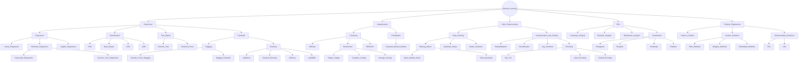

```mermaid
flowchart TD

    ML((Machine Learning))

    %% MAIN BRANCHES
    ML --> Supervised
    ML --> Unsupervised
    ML --> Data_Preprocessing
    ML --> EDA
    ML --> Feature_Engineering

    %% ---------------- SUPERVISED ----------------
    Supervised --> Regression
    Regression --> Linear_Regression
    Regression --> Nonlinear_Regression
    Nonlinear_Regression --> Polynomial_Regression
    Nonlinear_Regression --> Decision_Tree_Regression
    Regression --> Logistic_Regression

    Supervised --> Classification
    Classification --> KNN
    Classification --> Naive_Bayes
    Classification --> SVM
    Classification --> ANN

    Supervised --> Tree_Based
    Tree_Based --> Decision_Tree
    Tree_Based --> Random_Forest

    Supervised --> Ensemble
    Ensemble --> Bagging
    Bagging --> Random_Forest_Bagging
    Bagging --> Bagging_Classifier

    Ensemble --> Boosting
    Boosting --> AdaBoost
    Boosting --> Gradient_Boosting
    Boosting --> XGBoost
    Boosting --> LightGBM

    %% ---------------- UNSUPERVISED ----------------
    Unsupervised --> Clustering
    Clustering --> KMeans
    Clustering --> Hierarchical
    Hierarchical --> Single_Linkage
    Hierarchical --> Complete_Linkage
    Hierarchical --> Average_Linkage
    Clustering --> DBSCAN

    Unsupervised --> Probabilistic
    Probabilistic --> Gaussian_Mixture_Models

    %% ---------------- DATA PREPROCESSING ----------------
    Data_Preprocessing --> Data_Cleaning
    Data_Cleaning --> Missing_Values
    Missing_Values --> Mean_Median_Mode
    Missing_Values --> KNN_Imputation
    Data_Cleaning --> Duplicate_Values
    Data_Cleaning --> Outlier_Detection

    Data_Preprocessing --> Transformation_and_Scaling
    Transformation_and_Scaling --> Standardization
    Transformation_and_Scaling --> Normalization
    Transformation_and_Scaling --> Log_Transform
    Transformation_and_Scaling --> Encoding
    Encoding --> One_Hot
    Encoding --> Label_Encoding
    Encoding --> Ordinal_Encoding

    %% ---------------- EDA ----------------
    EDA --> Univariate_Analysis
    EDA --> Bivariate_Analysis
    EDA --> Multivariate_Analysis
    EDA --> Visualization
    Visualization --> Histograms
    Visualization --> Boxplots
    Visualization --> Heatmaps
    Visualization --> Pairplots

    %% ---------------- FEATURE ENGINEERING ----------------
    Feature_Engineering --> Feature_Creation
    Feature_Engineering --> Feature_Selection
    Feature_Selection --> Filter_Methods
    Feature_Selection --> Wrapper_Methods
    Feature_Selection --> Embedded_Methods

    Feature_Engineering --> Dimensionality_Reduction
    Dimensionality_Reduction --> PCA
    Dimensionality_Reduction --> LDA
```
